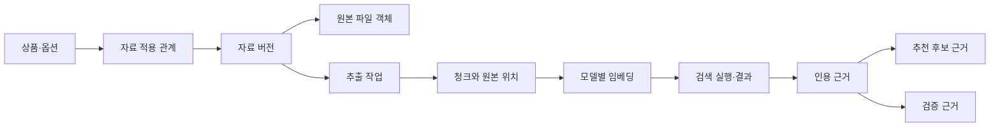
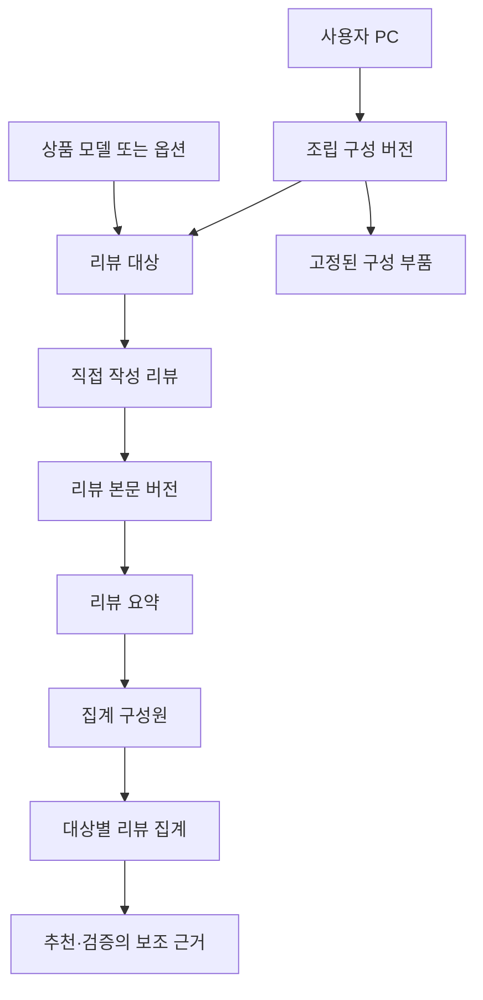
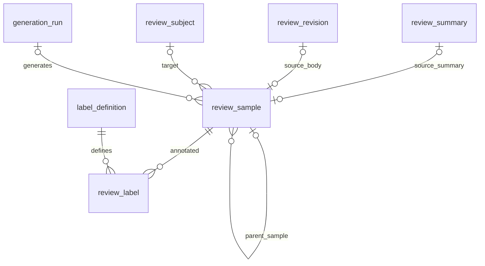

# 테이블 명세서 v6

개정일: 2026년 9월 11일 · 상태: 구현 전 설계 명세 · 대상: PostgreSQL + pgvector + 객체 저장소

이 명세서를 데이터베이스 설계 기준으로 한다. v6는 v5의 58개 테이블을 유지하면서 변경된 프론트 요구에 따라 이메일 인증 예정 상태, 계정 수정 시각과 UI 설정을 복원한다. 기존 설계 근거·2D/3D mockup·schema-v2.json은 이전 버전의 참고 자료이며, 이 문서와 차이가 있으면 이 문서를 우선한다.

## 1. 개발 범위와 변경 내용

| 변경 | 이번 개발에 반영하는 내용 |
|---|---|
| 요리 도메인 제외 | PC 본체 조립과 아기 용품만 제공. 요리 선택·레시피·인분·식재료 합산·잔량 계산을 구현하지 않는다. 공통 슬롯·보유 충족 구조는 유지한다. |
| 상품 자료 파일 | 설명서·사양표·이미지·인증 자료의 원본을 객체 저장소에 따로 보관. DB에는 원본 위치·해시·권한·상품 적용 범위와 버전을 저장한다. |
| RAG 검색과 근거 | 추출/OCR/이미지 설명 → 청크 → 임베딩 → 검색 기록 → 실제 인용 근거를 연결. 추천 후보와 검증 결과 모두에서 근거를 참조한다. |
| PC 리뷰 작성 | 로그인 사용자의 부품 리뷰와 전체 PC 구성 리뷰를 지원. 전체 리뷰는 변경 불가능한 조립 구성 버전에 연결한다. |
| 리뷰 원문 보관 정책 | 외부 수집 리뷰는 원문을 저장하지 않는다. 사용자가 서비스에 직접 작성한 리뷰는 본문을 저장하고 편집 버전을 관리한다. |
| 리뷰 데이터셋 증강 | 실제 리뷰에서 만든 표본과 합성 표본을 구분하고, 생성 실행·원천 표본·학습 분할을 추적한다. 합성 본문은 데이터셋 전용으로 저장한다. |
| 정답 라벨 | 표본별 복수 과제의 정답값, 라벨 정의 버전, 부여 방식, 검수 상태와 수정 이력을 저장한다. |
| 프론트 API 계약 | 비밀번호 인증·약관 동의·소프트 탈퇴, 리스트 소프트 삭제, 확정 목표금액·메모, 추천과 분리된 비동기 설명 상태를 기존 테이블에 저장한다. 화면 단계·예산 비율·합계는 파생값으로 저장하지 않는다. |

자료 파일과 사용자 작성 리뷰는 최신 요구로 추가된 데이터다. ‘외부 리뷰 원문 미보관’ 정책을 상품 설명서나 내부 작성 리뷰까지 확대 적용하지 않는다. 상품 자료는 수집·보관·검색·표시 권한이 확인된 자료를 처리한다.

### 1.1 이번 구현과 보류 범위

| 항목 | 이번 구현 | 이후 확장 |
|---|---|---|
| 리뷰 판정 | 실구매 표시와 독립인 세 가지 근거 판정·판정 근거 저장 | 별도 감성 등 과제 |
| 증강 | 실제 train 표본 하나 → 합성 여러 개 | 다중 부모·재증강 |
| 검수 | 학습 자동 라벨 + 표본 검수, 실제 평가 표본은 사람 검수 | 검수 업무 관리 시스템 |
| 보유품 | 필요 항목 전체를 보유로 충족하는 체크; PC 검증에는 실제 규격 확인 | 부분 수량 혼합 배분 |
| 계획 계층 | group → slot 또는 최상위 slot, group 중첩 금지 | 임의 깊이 계층 |
| 검색 | 추천·검증용 RAG, 활성 임베딩 모델 하나 | 독립 설명서 검색·동시 다중 모델 |
| 피드백 | 노출·교체·제외·확정 이벤트 저장 | 자동 학습 배치 |
| 버전 | 계획·PC 구성·자료·라벨 정의 버전 유지 | 정의 편집 관리 화면 |

기존 범용 컬럼은 향후 이관 비용을 줄이기 위해 유지하되 보류 기능을 이번 필수 구현으로 해석하지 않는다.

## 2. 물리 배치와 공통 규칙

### 2.1 저장소와 스키마

운영 DB는 하나로 시작한다. 파일은 별도 객체 저장소에 보관하며 벡터는 같은 PostgreSQL의 pgvector 컬럼에 저장한다. 별도 벡터 DB는 이번 설계의 필수 구성 요소가 아니다. pgvector는 PostgreSQL 안에서 벡터 저장과 유사도 검색을 지원한다. [pgvector 공식 문서](https://github.com/pgvector/pgvector)

| 스키마 | 테이블 수 | 책임 |
|---|---:|---|
| config | 2 | 도메인 정의 |
| identity | 4 | 계정·대화 |
| shared | 1 | 단위 |
| planning | 8 | 계획·구성·보유 충족 |
| catalog | 8 | 상품·판매·가격·근거 속성 |
| assets | 4 | 원본 파일·자료 버전·상품 적용 |
| rag | 6 | 추출·청크·임베딩·검색 |
| community | 5 | PC 조립 구성과 직접 작성 리뷰 |
| evidence | 6 | 출처·인용·리뷰 대상·요약·집계 |
| engine | 7 | 추천·검증·근거 연결·사용자 행동 기록 |
| notification | 3 | 가격 추적·판정·발송 |
| dataset | 4 | 리뷰 표본·단일 원천 증강·정답 라벨 |
| **합계** | **58** | **v2 53개 + dataset 4개 + feedback_event 1개** |

기존 테이블을 요리 전용으로 분리하지 않았으므로 요리 제외에 따른 공통 테이블 삭제는 없다. 기본 데이터·API·실행기·화면에서 해당 도메인을 제외한다. 신규 17개는 assets 4개, rag 6개, community 5개, evidence.review_aggregate_member, engine.candidate_evidence다.

위 신규 17개는 v2에서 추가한 테이블이다. v3에서는 dataset 스키마의 5개를 추가했고, v4에서는 4개로 단순화하고 행동 기록 1개를 추가했다. 실제 리뷰의 별점·요약 처리 결과는 정답 라벨과 별개이며, 모델이 실제 리뷰를 요약했다는 이유만으로 그 리뷰를 합성 리뷰로 분류하지 않는다.

### 2.2 컬럼 표 읽는 법

- `N`은 NULL 불가, `Y`는 NULL 허용이다. 기본값 `—`는 자동 기본값이 없어 호출자가 값을 제공해야 한다는 뜻이다.
- UUID는 `gen_random_uuid()`를 기본값으로 사용한다. 복합 PK 테이블에는 별도 id가 없다.
- 모든 테이블에 `created_at`이 있다. 변경 가능한 테이블의 `updated_at`은 INSERT 기본값뿐 아니라 UPDATE 트리거로 갱신해야 한다.
- 시각은 `timestamptz`로 저장하고 사용자 표시·종료일 계산 시 Asia/Seoul 등 사용자 시간대를 적용한다. 조립일·발행일은 `date`다.
- 금액은 `numeric(18,2)`와 통화 코드, 수량은 정밀 숫자형으로 저장한다. 물품 수량의 `each`는 정수만 허용한다.
- PK/FK/UNIQUE/CHECK로 강제할 수 있는 규칙은 DB에 구현한다. 다른 행·소유권·활성 버전·배분 합계 규칙은 6절의 트랜잭션 검증 또는 트리거로 구현한다. PostgreSQL의 일반 CHECK는 다른 행을 참조하는 업무 검증을 대신하지 않는다. [PostgreSQL 제약조건 문서](https://www.postgresql.org/docs/current/ddl-constraints.html)
- FK 삭제는 기본 RESTRICT다. 운영상 숨김·철회·탈퇴를 먼저 처리한다. 권리·보존 정책상 원문 삭제가 필요하면 8절의 정리 순서를 적용한다. 이력 보존이 삭제 의무보다 우선한다는 뜻은 아니다.
- 컬럼 설명에 열거한 상태값은 허용값 CHECK로 구현한다. 단계 전환은 별도 상태 전이 규칙으로 제한한다. JSONB는 객체 모양뿐 아니라 필수 키·자료형·단위를 검증한다.
- 게시된 정의·자료 내용·조립 구성·리뷰 본문·검색 결과는 덮어쓰지 않는다. `status`와 현재 버전 포인터 등 수명주기 필드만 지정된 절차로 바꾼다. 철회에 따른 원문·인용문 제거는 예외다.

이 문서는 실행 가능한 DDL이나 적용 완료 보고서가 아니다. 제약 이름·인덱스 중복·마이그레이션 의존 순서는 실제 DDL 작성 시 확정한다. 명세에서 필수로 정의한 교차 테이블 검증을 단순 단일 FK만 만들고 생략해서는 안 된다.

## 3. 핵심 관계

### 3.1 상품 자료의 근거 추적

원본 위치는 `evidence → retrieval_hit → document_chunk → ingestion_job → material_revision → file_object`로 추적한다. 페이지와 이미지 좌표는 청크에, 당시 표시 정보와 허용된 인용문은 evidence.citation_snapshot에 보존한다.

### 3.2 PC 리뷰 대상

`review_subject`의 product/variant/offer/build_version 중 정확히 하나만 값이 있다. 부품 리뷰 대상과 조립 전체 대상은 별개다. 사용자 PC 계획의 확정 버전을 리뷰 대상으로 직접 사용하지 않고, 실제 사용 구성을 별도로 확인해 고정한다.

### 3.3 리뷰 데이터셋·합성 증강·정답 라벨

실제 표본은 운영 리뷰 버전 또는 외부 데이터셋 식별자를 참조하고, 합성 표본은 generation_run과 실제 부모 표본 하나를 참조한다. 다중 원천 결합·합성본 재증강·원천 없는 신규 생성은 이번 구현에서 제외한다. 데이터셋 표본이 운영 review_summary나 review_aggregate로 역유입되는 경로는 만들지 않는다.

## 4. 테이블 목록

| 번호 | 테이블 | 역할 |
|---|---|---|
| 01 | [config.domain](#table-01) | 계획 도메인 |
| 02 | [config.domain_version](#table-02) | 도메인 정의 버전 |
| 03 | [identity.app_user](#table-03) | 사용자 |
| 04 | [identity.user_preference](#table-04) | 사용자 설정 |
| 05 | [identity.conversation](#table-05) | 대화 |
| 06 | [identity.message](#table-06) | 대화 메시지 |
| 07 | [shared.unit](#table-07) | 단위 |
| 08 | [planning.plan](#table-08) | 계획 |
| 09 | [planning.plan_revision](#table-09) | 계획 버전 |
| 10 | [planning.plan_condition](#table-10) | 사용자 조건 |
| 11 | [planning.plan_node](#table-11) | 그룹·슬롯 |
| 12 | [planning.requirement](#table-12) | 필요 항목 |
| 13 | [planning.owned_item](#table-13) | 보유 물품 |
| 14 | [planning.purchase_line](#table-14) | 구매 항목 |
| 15 | [planning.fulfillment_allocation](#table-15) | 필요 충족 연결 |
| 16 | [catalog.product](#table-16) | 상품 모델 |
| 17 | [catalog.product_variant](#table-17) | 상품 옵션 |
| 18 | [catalog.product_category](#table-18) | 상품 분류 |
| 19 | [catalog.product_category_membership](#table-19) | 상품 분류 연결 |
| 20 | [catalog.product_fact](#table-20) | 근거가 있는 속성 |
| 21 | [catalog.merchant](#table-21) | 판매처 |
| 22 | [catalog.offer](#table-22) | 판매 제안 |
| 23 | [catalog.offer_observation](#table-23) | 가격·재고 관측 |
| 24 | [assets.file_object](#table-24) | 원본 파일 객체 |
| 25 | [assets.product_material](#table-25) | 상품 자료 |
| 26 | [assets.material_revision](#table-26) | 상품 자료 버전 |
| 27 | [assets.material_applicability](#table-27) | 자료 적용 상품 |
| 28 | [rag.ingestion_job](#table-28) | 자료 추출 작업 |
| 29 | [rag.document_chunk](#table-29) | 검색용 자료 조각 |
| 30 | [rag.embedding_profile](#table-30) | 임베딩 설정 |
| 31 | [rag.chunk_embedding](#table-31) | 청크 벡터 |
| 32 | [rag.retrieval_run](#table-32) | RAG 검색 실행 |
| 33 | [rag.retrieval_hit](#table-33) | RAG 검색 결과 |
| 34 | [community.pc_build](#table-34) | 사용자 PC |
| 35 | [community.pc_build_version](#table-35) | 조립 구성 버전 |
| 36 | [community.pc_build_component](#table-36) | 조립 구성 부품 |
| 37 | [community.review](#table-37) | 서비스 작성 리뷰 |
| 38 | [community.review_revision](#table-38) | 리뷰 본문 버전 |
| 39 | [evidence.source](#table-39) | 출처 |
| 40 | [evidence.evidence](#table-40) | 인용 근거 |
| 41 | [evidence.review_subject](#table-41) | 리뷰 대상 |
| 42 | [evidence.review_summary](#table-42) | 리뷰 요약 |
| 43 | [evidence.review_aggregate](#table-43) | 리뷰 집계 |
| 44 | [evidence.review_aggregate_member](#table-44) | 집계 포함 리뷰 |
| 45 | [engine.recommendation_run](#table-45) | 추천 실행 |
| 46 | [engine.recommendation_candidate](#table-46) | 추천 후보 |
| 47 | [engine.candidate_evidence](#table-47) | 후보 추천 근거 |
| 48 | [engine.validation_result](#table-48) | 검사 결과 |
| 49 | [engine.validation_target](#table-49) | 검사 대상 연결 |
| 50 | [engine.validation_evidence](#table-50) | 검사 근거 연결 |
| 51 | [notification.price_watch](#table-51) | 가격 추적 |
| 52 | [notification.price_watch_evaluation](#table-52) | 가격 판정 |
| 53 | [notification.notification_event](#table-53) | 알림 이벤트 |
| 54 | [dataset.generation_run](#table-54) | 합성 생성 실행 |
| 55 | [dataset.review_sample](#table-55) | 실제·합성 리뷰 데이터셋 표본 |
| 56 | [engine.feedback_event](#table-56) | 추천 노출·교체·제외·확정 기록 |
| 57 | [dataset.label_definition](#table-57) | 정답 라벨 정의 버전 |
| 58 | [dataset.review_label](#table-58) | 표본별 정답 라벨과 검수 이력 |

## 5. 테이블별 상세 명세

### 01. `config.domain` — 계획 도메인

현재 개발 범위는 PC 본체 조립과 아기 용품이다.

**PK:** `id`. **공통 FK 삭제 정책:** RESTRICT; 물리 삭제는 별도 정리 절차.

| 컬럼 | PostgreSQL 타입 | NULL 허용 | 기본값 | FK 참조 | 설명 |
|---|---|:---:|---|---|---|
| `id` | `uuid` | N | gen_random_uuid() | — | 기본키 |
| `code` | `text` | N | — | — | 변경하지 않는 도메인 코드 |
| `name` | `text` | N | — | — | 한국어 표시명 |
| `status` | `text` | N | 'draft' | — | draft/active/disabled |
| `created_at` | `timestamptz` | N | now() | — | 최초 생성 시각 |
| `updated_at` | `timestamptz` | N | now() | — | 변경 트리거가 갱신하는 시각 |

**제약·업무 규칙**

- UNIQUE(code)
- 출시 등록값은 pc_build와 baby_prep만 허용하고 요리 도메인의 화면·API·배치 실행을 비활성화한다. 코드 타입 자체는 확장을 위해 text로 둔다.

**인덱스 제안**

- PK/UNIQUE 인덱스 및 각 FK 선두 인덱스를 기본으로 한다. 중복 인덱스는 합친다.

### 02. `config.domain_version` — 도메인 정의 버전

필수 입력·질문·슬롯·검증·평가 축의 게시 버전을 고정한다.

**PK:** `id`. **공통 FK 삭제 정책:** RESTRICT; 물리 삭제는 별도 정리 절차.

| 컬럼 | PostgreSQL 타입 | NULL 허용 | 기본값 | FK 참조 | 설명 |
|---|---|:---:|---|---|---|
| `id` | `uuid` | N | gen_random_uuid() | — | 기본키 |
| `domain_id` | `uuid` | N | — | config.domain.id | 소속 도메인 |
| `version_no` | `integer` | N | — | — | 도메인 내 버전 번호 |
| `definition` | `jsonb` | N | — | — | 질문·슬롯·validator 참조·평가 축·표시 정의 |
| `attribute_schema` | `jsonb` | N | — | — | 속성 자료형·단위·범위 정의 |
| `content_hash` | `text` | N | — | — | 정규화한 정의의 SHA-256 |
| `created_at` | `timestamptz` | N | now() | — | 최초 생성 시각 |

**제약·업무 규칙**

- UNIQUE(domain_id,version_no)
- CHECK(version_no>0)
- DB에는 검증을 마친 게시 버전만 등록하고 정의를 덮어쓰지 않는다. 변경은 새 version_no로 등록한다. 게시 전 초안은 버전 관리 저장소에서 관리한다. 현재 PC 슬롯은 CPU/GPU/RAM/메인보드/저장장치/파워/케이스/쿨러이며 recipe·인분·재료 계산 정의는 생성하지 않는다.

**인덱스 제안**

- PK/UNIQUE 인덱스 및 각 FK 선두 인덱스를 기본으로 한다. 중복 인덱스는 합친다.

### 03. `identity.app_user` — 사용자

계정 소유권과 리뷰 작성자를 식별한다.

**PK:** `id`. **공통 FK 삭제 정책:** RESTRICT; 물리 삭제는 별도 정리 절차.

| 컬럼 | PostgreSQL 타입 | NULL 허용 | 기본값 | FK 참조 | 설명 |
|---|---|:---:|---|---|---|
| `id` | `uuid` | N | gen_random_uuid() | — | 기본키 |
| `email_normalized` | `text` | N | — | — | 정규화 이메일 |
| `auth_subject` | `text` | N | — | — | 인증 서비스의 고유 사용자 키 |
| `display_name` | `text` | N | — | — | 표시 이름 |
| `status` | `text` | N | 'active' | — | active/suspended/deleted |
| `email_verified_at` | `timestamptz` | Y | — | — | 현재 이메일의 소유 확인 시각; 미인증이면 NULL |
| `password_hash` | `text` | Y | — | — | argon2id 인코딩 문자열; 평문 금지, 탈퇴 시 NULL |
| `password_updated_at` | `timestamptz` | Y | — | — | 비밀번호 설정·변경 시각과 이전 토큰 무효화 기준 |
| `failed_login_count` | `integer` | N | 0 | — | 연속 로그인 실패 횟수 |
| `locked_until` | `timestamptz` | Y | — | — | 일시 잠금 해제 시각 |
| `last_login_at` | `timestamptz` | Y | — | — | 마지막 로그인 성공 시각 |
| `terms_version` | `text` | Y | — | — | 동의한 이용약관 버전 |
| `terms_agreed_at` | `timestamptz` | Y | — | — | 이용약관 동의 시각 |
| `privacy_agreed_at` | `timestamptz` | Y | — | — | 개인정보 처리방침 동의 시각 |
| `marketing_agreed_at` | `timestamptz` | Y | — | — | 현재 마케팅 수신 동의 시각; 미동의·철회 시 NULL |
| `deleted_at` | `timestamptz` | Y | — | — | 소프트 탈퇴 시각 |
| `created_at` | `timestamptz` | N | now() | — | 최초 생성 시각 |
| `updated_at` | `timestamptz` | N | now() | — | 프로필·인증·보안 상태의 마지막 변경 시각 |

**제약·업무 규칙**

- UNIQUE(email_normalized)
- UNIQUE(auth_subject)
- CHECK(failed_login_count>=0), password_hash가 있으면 password_updated_at이 필수이고 terms_version/terms_agreed_at은 함께 NULL이거나 함께 값이 있다. 탈퇴 시 비밀번호 해시는 지워도 이전 토큰 차단 기준인 password_updated_at은 유지한다.
- status='deleted'와 deleted_at 존재 여부는 일치해야 한다. 가입 시 비밀번호·필수 동의는 API 트랜잭션에서 검사하며 탈퇴 시 이메일·표시 이름을 익명화하고 비밀번호·선택 동의를 제거한다.
- 해커톤 가입은 email_verified_at=NULL을 허용한다. 이메일 인증 완료 시 기록하고 이메일 변경 시 다시 NULL로 만든다. 인증 조회는 password_hash를 제외한 명시적 컬럼만 선택하고 SELECT *를 금지한다.
- updated_at은 행의 일반 변경 시각이며 password_updated_at·last_login_at·동의·탈퇴 시각을 대신하지 않는다.

**인덱스 제안**

- PK/UNIQUE 인덱스 및 각 FK 선두 인덱스를 기본으로 한다. 중복 인덱스는 합친다.

### 04. `identity.user_preference` — 사용자 설정

알림 설정을 사용자별로 보존한다.

**PK:** `user_id`. **공통 FK 삭제 정책:** RESTRICT; 물리 삭제는 별도 정리 절차.

| 컬럼 | PostgreSQL 타입 | NULL 허용 | 기본값 | FK 참조 | 설명 |
|---|---|:---:|---|---|---|
| `user_id` | `uuid` | N | — | identity.app_user.id | PK 겸 사용자 FK |
| `ui_settings` | `jsonb` | N | '{}'::jsonb | — | 패널 폭·접힘 등 사용자별 화면 설정 |
| `notification_settings` | `jsonb` | N | '{}'::jsonb | — | 알림 수신 설정 |
| `created_at` | `timestamptz` | N | now() | — | 최초 생성 시각 |
| `updated_at` | `timestamptz` | N | now() | — | 변경 트리거가 갱신하는 시각 |

**제약·업무 규칙**

- 두 JSON의 스키마를 각각 검증한다. ui_settings는 표시 편의만 저장하고 인증·권한 판단값을 넣지 않는다.

**인덱스 제안**

- PK/UNIQUE 인덱스 및 각 FK 선두 인덱스를 기본으로 한다. 중복 인덱스는 합친다.

### 05. `identity.conversation` — 대화

비로그인 대화를 로그인 계정에 귀속할 수 있다.

**PK:** `id`. **공통 FK 삭제 정책:** RESTRICT; 물리 삭제는 별도 정리 절차.

| 컬럼 | PostgreSQL 타입 | NULL 허용 | 기본값 | FK 참조 | 설명 |
|---|---|:---:|---|---|---|
| `id` | `uuid` | N | gen_random_uuid() | — | 기본키 |
| `user_id` | `uuid` | Y | — | identity.app_user.id | 로그인 소유자 |
| `guest_session_hash` | `text` | Y | — | — | 비로그인 접근 토큰의 해시 |
| `expires_at` | `timestamptz` | Y | — | — | 임시 대화 만료 |
| `created_at` | `timestamptz` | N | now() | — | 최초 생성 시각 |

**제약·업무 규칙**

- user_id 또는 guest_session_hash 중 하나 이상 필수
- 계정 귀속은 세션 소유 확인 후 트랜잭션 처리하고 guest 토큰은 폐기한다.

**인덱스 제안**

- PK/UNIQUE 인덱스 및 각 FK 선두 인덱스를 기본으로 한다. 중복 인덱스는 합친다.
- (user_id,created_at DESC)

### 06. `identity.message` — 대화 메시지

원문 사용자 조건의 출처를 제공한다.

**PK:** `id`. **공통 FK 삭제 정책:** RESTRICT; 물리 삭제는 별도 정리 절차.

| 컬럼 | PostgreSQL 타입 | NULL 허용 | 기본값 | FK 참조 | 설명 |
|---|---|:---:|---|---|---|
| `id` | `uuid` | N | gen_random_uuid() | — | 기본키 |
| `conversation_id` | `uuid` | N | — | identity.conversation.id | 소속 대화 |
| `role` | `text` | N | — | — | user/assistant/system |
| `content` | `text` | N | — | — | 메시지 내용 |
| `client_message_id` | `text` | N | — | — | 재전송 식별 키 |
| `created_at` | `timestamptz` | N | now() | — | 최초 생성 시각 |

**제약·업무 규칙**

- UNIQUE(conversation_id,client_message_id)
- role 허용값 CHECK. 자료 파일 원문이나 외부 리뷰 원문을 메시지·디버그 로그에 무분별하게 복제하지 않는다.

**인덱스 제안**

- PK/UNIQUE 인덱스 및 각 FK 선두 인덱스를 기본으로 한다. 중복 인덱스는 합친다.
- (conversation_id,created_at)

### 07. `shared.unit` — 단위

부품 개수와 길이·전력·무게 등의 의미를 통일한다.

**PK:** `code`. **공통 FK 삭제 정책:** RESTRICT; 물리 삭제는 별도 정리 절차.

| 컬럼 | PostgreSQL 타입 | NULL 허용 | 기본값 | FK 참조 | 설명 |
|---|---|:---:|---|---|---|
| `code` | `text` | N | — | — | PK: each/mm/cm/W/kg 등 |
| `dimension` | `text` | N | — | — | count/length/power/mass 등 |
| `base_unit_code` | `text` | Y | — | shared.unit.code | 같은 차원의 기준 단위 |
| `factor` | `numeric(20,8)` | N | 1 | — | 기준 단위 환산 계수 |
| `created_at` | `timestamptz` | N | now() | — | 최초 생성 시각 |
| `updated_at` | `timestamptz` | N | now() | — | 변경 트리거가 갱신하는 시각 |

**제약·업무 규칙**

- CHECK(factor>0)
- 참조 단위와 같은 차원인지 저장 서비스에서 확인. 이번 범위에서 식재료 포장 환산 엔진은 구현하지 않는다.

**인덱스 제안**

- PK/UNIQUE 인덱스 및 각 FK 선두 인덱스를 기본으로 한다. 중복 인덱스는 합친다.

### 08. `planning.plan` — 계획

대화 하나의 지속적인 리스트 식별자다.

**PK:** `id`. **공통 FK 삭제 정책:** RESTRICT; 물리 삭제는 별도 정리 절차.

| 컬럼 | PostgreSQL 타입 | NULL 허용 | 기본값 | FK 참조 | 설명 |
|---|---|:---:|---|---|---|
| `id` | `uuid` | N | gen_random_uuid() | — | 기본키 |
| `conversation_id` | `uuid` | N | — | identity.conversation.id | 대화와 1:1 |
| `owner_user_id` | `uuid` | Y | — | identity.app_user.id | 확정 전에는 비로그인 가능 |
| `name` | `text` | N | — | — | 현재 이름 |
| `current_revision_id` | `uuid` | Y | — | planning.plan_revision.id | 현재 표시 버전 |
| `status` | `text` | N | 'active' | — | active/deleted |
| `deleted_at` | `timestamptz` | Y | — | — | 목록에서 숨긴 소프트 삭제 시각 |
| `created_at` | `timestamptz` | N | now() | — | 최초 생성 시각 |
| `updated_at` | `timestamptz` | N | now() | — | 변경 트리거가 갱신하는 시각 |

**제약·업무 규칙**

- UNIQUE(conversation_id)
- current_revision은 같은 plan 소속. 계정 귀속 시 conversation.user_id와 owner_user_id를 함께 맞춘다.
- status='deleted'와 deleted_at 존재 여부는 일치한다. 참조 이력을 보존하므로 리스트 삭제 API는 물리 삭제하지 않으며 삭제된 계획은 일반 조회·추천·알림 대상에서 제외한다.

**인덱스 제안**

- PK/UNIQUE 인덱스 및 각 FK 선두 인덱스를 기본으로 한다. 중복 인덱스는 합친다.
- (owner_user_id,updated_at DESC)

### 09. `planning.plan_revision` — 계획 버전

확정 당시 구성·금액·조건을 고정한다.

**PK:** `id`. **공통 FK 삭제 정책:** RESTRICT; 물리 삭제는 별도 정리 절차.

| 컬럼 | PostgreSQL 타입 | NULL 허용 | 기본값 | FK 참조 | 설명 |
|---|---|:---:|---|---|---|
| `id` | `uuid` | N | gen_random_uuid() | — | 기본키 |
| `plan_id` | `uuid` | N | — | planning.plan.id | 원본 계획 |
| `revision_no` | `integer` | N | — | — | 버전 번호 |
| `domain_version_id` | `uuid` | N | — | config.domain_version.id | 적용한 도메인 정의 |
| `state` | `text` | N | 'draft' | — | draft/confirmed |
| `lock_version` | `integer` | N | 0 | — | 낙관적 동시 수정 번호 |
| `name_snapshot` | `text` | N | — | — | 해당 버전의 이름 |
| `confirmed_at` | `timestamptz` | Y | — | — | 확정 시각 |
| `planned_purchase_at` | `timestamptz` | Y | — | — | 구매 예정 시각 |
| `target_amount` | `numeric(18,2)` | Y | — | — | 확정 당시 사용자가 정한 목표금액 |
| `memo` | `text` | N | '' | — | 확정 메모, 최대 1000자 |
| `confirmed_total` | `numeric(18,2)` | Y | — | — | 확정 금액 |
| `currency` | `char(3)` | N | 'KRW' | — | 통화 |
| `pricing_policy` | `jsonb` | N | '{}'::jsonb | — | 배송비·할인·유효 시각 기준 |
| `created_at` | `timestamptz` | N | now() | — | 최초 생성 시각 |
| `updated_at` | `timestamptz` | N | now() | — | 변경 트리거가 갱신하는 시각 |

**제약·업무 규칙**

- UNIQUE(plan_id,revision_no)
- UNIQUE(id,plan_id)
- confirmed이면 소유자·confirmed_at·confirmed_total 필수이며 하위 조건·구성 변경 금지. 수정하기는 새 초안을 생성한다.
- CHECK(revision_no>0 AND lock_version>=0)
- confirmed_total과 target_amount는 0 이상이고 memo는 1000자 이하이다. 목표금액은 확정 스냅샷이며 notification.price_watch.target_amount는 실제 추적 설정이므로 역할이 다르다.

**인덱스 제안**

- PK/UNIQUE 인덱스 및 각 FK 선두 인덱스를 기본으로 한다. 중복 인덱스는 합친다.
- (plan_id,state)

### 10. `planning.plan_condition` — 사용자 조건

명시 입력과 추정 및 수정 이력을 구분한다.

**PK:** `id`. **공통 FK 삭제 정책:** RESTRICT; 물리 삭제는 별도 정리 절차.

| 컬럼 | PostgreSQL 타입 | NULL 허용 | 기본값 | FK 참조 | 설명 |
|---|---|:---:|---|---|---|
| `id` | `uuid` | N | gen_random_uuid() | — | 기본키 |
| `revision_id` | `uuid` | N | — | planning.plan_revision.id | 소속 버전 |
| `condition_key` | `text` | N | — | — | budget_max/age_months 등 |
| `value` | `jsonb` | N | — | — | 도메인 스키마를 통과한 값 |
| `origin` | `text` | N | — | — | explicit/extracted/inferred |
| `source_message_id` | `uuid` | Y | — | identity.message.id | 원문 메시지 |
| `supersedes_id` | `uuid` | Y | — | planning.plan_condition.id | 이전 조건 |
| `status` | `text` | N | 'active' | — | active/superseded/deleted |
| `created_at` | `timestamptz` | N | now() | — | 최초 생성 시각 |
| `updated_at` | `timestamptz` | N | now() | — | 변경 트리거가 갱신하는 시각 |

**제약·업무 규칙**

- 활성 조건은 UNIQUE(revision_id,condition_key) WHERE status=active
- 메시지는 같은 plan의 대화에 속해야 한다. 이전 조건은 같은 버전·키여야 한다.

**인덱스 제안**

- PK/UNIQUE 인덱스 및 각 FK 선두 인덱스를 기본으로 한다. 중복 인덱스는 합친다.
- (revision_id,status)

### 11. `planning.plan_node` — 그룹·슬롯

PC 슬롯과 아기 용품 그룹·시점 표시를 지원한다.

**PK:** `id`. **공통 FK 삭제 정책:** RESTRICT; 물리 삭제는 별도 정리 절차.

| 컬럼 | PostgreSQL 타입 | NULL 허용 | 기본값 | FK 참조 | 설명 |
|---|---|:---:|---|---|---|
| `id` | `uuid` | N | gen_random_uuid() | — | 기본키 |
| `revision_id` | `uuid` | N | — | planning.plan_revision.id | 계획 버전 |
| `parent_id` | `uuid` | Y | — | planning.plan_node.id | 상위 노드 |
| `node_type` | `text` | N | — | — | group/slot |
| `template_key` | `text` | N | — | — | 정의 파일 내 키 |
| `name` | `text` | N | — | — | 표시 이름 |
| `position` | `integer` | N | 0 | — | 정렬 순서 |
| `context` | `jsonb` | N | '{}'::jsonb | — | 표시와 필요 시점 문맥 |
| `created_at` | `timestamptz` | N | now() | — | 최초 생성 시각 |
| `updated_at` | `timestamptz` | N | now() | — | 변경 트리거가 갱신하는 시각 |

**제약·업무 규칙**

- UNIQUE(id,revision_id)
- parent_id는 같은 버전이며 순환 참조 금지. recipe 노드 유형은 이번 릴리스에서 허용하지 않는다.
- 초기에는 group은 부모가 없고 slot의 부모는 없거나 최상위 group 하나다. 자의적인 깊이의 계층은 저장 서비스에서 거절하며 일반 재귀 편집 엔진은 보류한다.

**인덱스 제안**

- PK/UNIQUE 인덱스 및 각 FK 선두 인덱스를 기본으로 한다. 중복 인덱스는 합친다.
- (revision_id,parent_id,position)

### 12. `planning.requirement` — 필요 항목

구매 전에 빈 슬롯과 보유 충족을 표현한다.

**PK:** `id`. **공통 FK 삭제 정책:** RESTRICT; 물리 삭제는 별도 정리 절차.

| 컬럼 | PostgreSQL 타입 | NULL 허용 | 기본값 | FK 참조 | 설명 |
|---|---|:---:|---|---|---|
| `id` | `uuid` | N | gen_random_uuid() | — | 기본키 |
| `revision_id` | `uuid` | N | — | planning.plan_revision.id | 계획 버전 |
| `node_id` | `uuid` | N | — | planning.plan_node.id | 같은 버전의 슬롯 |
| `quantity` | `numeric(18,4)` | N | 1 | — | 필요량 |
| `unit_code` | `text` | N | 'each' | shared.unit.code | 필요량 단위 |
| `required` | `boolean` | N | true | — | 확정 시 충족 필수 여부 |
| `needed_at` | `timestamptz` | Y | — | — | 필요 시점 |
| `timing_context` | `jsonb` | N | '{}'::jsonb | — | 월령·기준일 등 |
| `match_spec` | `jsonb` | N | '{}'::jsonb | — | 허용 부품 유형·제품 조건 |
| `status` | `text` | N | 'active' | — | active/excluded |
| `created_at` | `timestamptz` | N | now() | — | 최초 생성 시각 |
| `updated_at` | `timestamptz` | N | now() | — | 변경 트리거가 갱신하는 시각 |

**제약·업무 규칙**

- UNIQUE(id,revision_id)
- CHECK(quantity>0)
- node와 같은 버전. 제외가 필수 충족을 의미하지 않으며 도메인 정책으로 판단한다.

**인덱스 제안**

- PK/UNIQUE 인덱스 및 각 FK 선두 인덱스를 기본으로 한다. 중복 인덱스는 합친다.
- (revision_id,status)

### 13. `planning.owned_item` — 보유 물품

아기 용품의 이미 보유한 물품을 계획 시점에 기록한다.

**PK:** `id`. **공통 FK 삭제 정책:** RESTRICT; 물리 삭제는 별도 정리 절차.

| 컬럼 | PostgreSQL 타입 | NULL 허용 | 기본값 | FK 참조 | 설명 |
|---|---|:---:|---|---|---|
| `id` | `uuid` | N | gen_random_uuid() | — | 기본키 |
| `revision_id` | `uuid` | N | — | planning.plan_revision.id | 계획 버전 |
| `variant_id` | `uuid` | Y | — | catalog.product_variant.id | 알려진 옵션 |
| `item_spec` | `jsonb` | N | '{}'::jsonb | — | 미등록 보유품 설명 |
| `quantity` | `numeric(18,4)` | N | 1 | — | 사용 가능 수량 |
| `unit_code` | `text` | N | 'each' | shared.unit.code | 수량 단위 |
| `source_condition_id` | `uuid` | Y | — | planning.plan_condition.id | 보유 입력 근거 |
| `created_at` | `timestamptz` | N | now() | — | 최초 생성 시각 |
| `updated_at` | `timestamptz` | N | now() | — | 변경 트리거가 갱신하는 시각 |

**제약·업무 규칙**

- UNIQUE(id,revision_id)
- CHECK(quantity>0)
- variant_id가 없으면 식별 가능한 item_spec 필수. PC 보유 부품 선택 UI는 이번 변경으로 자동 추가하지 않는다.

**인덱스 제안**

- PK/UNIQUE 인덱스 및 각 FK 선두 인덱스를 기본으로 한다. 중복 인덱스는 합친다.

### 14. `planning.purchase_line` — 구매 항목

판매 제안과 당시 가격을 고정한 추천 구매 기록이다.

**PK:** `id`. **공통 FK 삭제 정책:** RESTRICT; 물리 삭제는 별도 정리 절차.

| 컬럼 | PostgreSQL 타입 | NULL 허용 | 기본값 | FK 참조 | 설명 |
|---|---|:---:|---|---|---|
| `id` | `uuid` | N | gen_random_uuid() | — | 기본키 |
| `revision_id` | `uuid` | N | — | planning.plan_revision.id | 계획 버전 |
| `offer_id` | `uuid` | N | — | catalog.offer.id | 선택한 판매 제안 |
| `selected_observation_id` | `uuid` | N | — | catalog.offer_observation.id | 같은 offer의 선택 시점 관측 |
| `pack_count` | `integer` | N | 1 | — | 구매 단위 수 |
| `line_amount` | `numeric(18,2)` | N | — | — | 선택 당시 금액 |
| `currency` | `char(3)` | N | 'KRW' | — | 통화 |
| `snapshot` | `jsonb` | N | — | — | 상품명·옵션·수량·구매 링크의 표시 스냅샷 |
| `created_at` | `timestamptz` | N | now() | — | 최초 생성 시각 |
| `updated_at` | `timestamptz` | N | now() | — | 변경 트리거가 갱신하는 시각 |

**제약·업무 규칙**

- UNIQUE(id,revision_id)
- CHECK(pack_count>0 AND line_amount>=0)
- 관측의 offer와 offer_id 일치. 계획 통화와 동일. 주문·구매완료를 뜻하지 않는다.

**인덱스 제안**

- PK/UNIQUE 인덱스 및 각 FK 선두 인덱스를 기본으로 한다. 중복 인덱스는 합친다.
- (revision_id)

### 15. `planning.fulfillment_allocation` — 필요 충족 연결

필요 항목을 구매 또는 보유 항목으로 충족한다.

**PK:** `id`. **공통 FK 삭제 정책:** RESTRICT; 물리 삭제는 별도 정리 절차.

| 컬럼 | PostgreSQL 타입 | NULL 허용 | 기본값 | FK 참조 | 설명 |
|---|---|:---:|---|---|---|
| `id` | `uuid` | N | gen_random_uuid() | — | 기본키 |
| `revision_id` | `uuid` | N | — | planning.plan_revision.id | 공통 계획 버전 |
| `requirement_id` | `uuid` | N | — | planning.requirement.id | 충족 대상 |
| `purchase_line_id` | `uuid` | Y | — | planning.purchase_line.id | 구매로 충족 |
| `owned_item_id` | `uuid` | Y | — | planning.owned_item.id | 보유로 충족 |
| `quantity` | `numeric(18,4)` | N | 1 | — | 충족량 |
| `unit_code` | `text` | N | 'each' | shared.unit.code | 충족 단위 |
| `created_at` | `timestamptz` | N | now() | — | 최초 생성 시각 |
| `updated_at` | `timestamptz` | N | now() | — | 변경 트리거가 갱신하는 시각 |

**제약·업무 규칙**

- UNIQUE(id,revision_id)
- CHECK(num_nonnulls(purchase_line_id,owned_item_id)=1 AND quantity>0)
- 모든 참조는 같은 버전. 배분 합계·호환 단위 검증은 잠금 또는 버전 검사와 함께 트랜잭션에서 수행.
- 초기에는 requirement당 연결 하나, purchase_line/owned_item당 연결 하나만 허용한다(저장 서비스에서 잠금 후 검사). 보유 체크는 전체 필요량을 보유로 충족한다는 확인이며 일부만 보유하면 초기 보유 충족으로 처리하지 않는다. 구매와 보유를 섞어 배분하는 UI·계산은 보류한다.
- 개수(each)는 정수로 처리한다. 구매 묶음 수는 ceil(필요 개수/pack_quantity), 비용은 묶음 수 전체로 계산하고 실제 충족량은 필요 개수로 기록한다. 남는 수량을 다른 필요 항목에 자동 배분하지 않는다. 규격 검증용 mm/W 등의 단위는 유지한다.

**인덱스 제안**

- PK/UNIQUE 인덱스 및 각 FK 선두 인덱스를 기본으로 한다. 중복 인덱스는 합친다.
- (requirement_id)
- (purchase_line_id)
- (owned_item_id)

### 16. `catalog.product` — 상품 모델

두 도메인에서 공유하는 상품의 정체성이다.

**PK:** `id`. **공통 FK 삭제 정책:** RESTRICT; 물리 삭제는 별도 정리 절차.

| 컬럼 | PostgreSQL 타입 | NULL 허용 | 기본값 | FK 참조 | 설명 |
|---|---|:---:|---|---|---|
| `id` | `uuid` | N | gen_random_uuid() | — | 기본키 |
| `name` | `text` | N | — | — | 상품명 |
| `brand` | `text` | N | — | — | 브랜드 |
| `model` | `text` | N | — | — | 모델명 |
| `product_type` | `text` | N | — | — | cpu/gpu/motherboard/stroller 등 |
| `attributes` | `jsonb` | N | '{}'::jsonb | — | 현재 표시용 속성 |
| `image_url` | `text` | Y | — | — | 대표 썸네일 표시용 URL |
| `status` | `text` | N | 'active' | — | active/discontinued |
| `created_at` | `timestamptz` | N | now() | — | 최초 생성 시각 |
| `updated_at` | `timestamptz` | N | now() | — | 변경 트리거가 갱신하는 시각 |

**제약·업무 규칙**

- 단일 domain_id를 두지 않는다. RAG 원본 이미지는 assets에 보관하고 image_url은 검색 근거 식별자로 사용하지 않는다.

**인덱스 제안**

- PK/UNIQUE 인덱스 및 각 FK 선두 인덱스를 기본으로 한다. 중복 인덱스는 합친다.
- (brand,model)
- (product_type,status)

### 17. `catalog.product_variant` — 상품 옵션

용량·규격·포장 단위가 다른 실제 옵션을 구분한다.

**PK:** `id`. **공통 FK 삭제 정책:** RESTRICT; 물리 삭제는 별도 정리 절차.

| 컬럼 | PostgreSQL 타입 | NULL 허용 | 기본값 | FK 참조 | 설명 |
|---|---|:---:|---|---|---|
| `id` | `uuid` | N | gen_random_uuid() | — | 기본키 |
| `product_id` | `uuid` | N | — | catalog.product.id | 상품 모델 |
| `variant_key` | `text` | N | — | — | 모델 내 표준 옵션 키 |
| `gtin` | `text` | Y | — | — | 확인된 표준 상품 코드 |
| `attributes` | `jsonb` | N | '{}'::jsonb | — | 용량·규격·색상 등 |
| `pack_quantity` | `numeric(18,4)` | N | 1 | — | 판매 단위 내 개수 |
| `unit_code` | `text` | N | 'each' | shared.unit.code | 수량 단위 |
| `created_at` | `timestamptz` | N | now() | — | 최초 생성 시각 |
| `updated_at` | `timestamptz` | N | now() | — | 변경 트리거가 갱신하는 시각 |

**제약·업무 규칙**

- UNIQUE(product_id,variant_key)
- UNIQUE(id,product_id)
- gtin은 값이 있는 경우 UNIQUE. CHECK(pack_quantity>0).

**인덱스 제안**

- PK/UNIQUE 인덱스 및 각 FK 선두 인덱스를 기본으로 한다. 중복 인덱스는 합친다.
- (product_id)

### 18. `catalog.product_category` — 상품 분류

목적 도메인과 독립적인 상품 분류다.

**PK:** `id`. **공통 FK 삭제 정책:** RESTRICT; 물리 삭제는 별도 정리 절차.

| 컬럼 | PostgreSQL 타입 | NULL 허용 | 기본값 | FK 참조 | 설명 |
|---|---|:---:|---|---|---|
| `id` | `uuid` | N | gen_random_uuid() | — | 기본키 |
| `parent_id` | `uuid` | Y | — | catalog.product_category.id | 상위 분류 |
| `code` | `text` | N | — | — | 분류 코드 |
| `name` | `text` | N | — | — | 분류 이름 |
| `created_at` | `timestamptz` | N | now() | — | 최초 생성 시각 |
| `updated_at` | `timestamptz` | N | now() | — | 변경 트리거가 갱신하는 시각 |

**제약·업무 규칙**

- UNIQUE(code)
- 부모 순환 참조 금지.

**인덱스 제안**

- PK/UNIQUE 인덱스 및 각 FK 선두 인덱스를 기본으로 한다. 중복 인덱스는 합친다.

### 19. `catalog.product_category_membership` — 상품 분류 연결

상품의 다중 분류를 표현한다.

**PK:** `product_id, category_id`. **공통 FK 삭제 정책:** RESTRICT; 물리 삭제는 별도 정리 절차.

| 컬럼 | PostgreSQL 타입 | NULL 허용 | 기본값 | FK 참조 | 설명 |
|---|---|:---:|---|---|---|
| `product_id` | `uuid` | N | — | catalog.product.id | 상품 |
| `category_id` | `uuid` | N | — | catalog.product_category.id | 분류 |
| `created_at` | `timestamptz` | N | now() | — | 최초 생성 시각 |

**제약·업무 규칙**

- 복합 PK로 같은 연결 중복 방지.

**인덱스 제안**

- PK/UNIQUE 인덱스 및 각 FK 선두 인덱스를 기본으로 한다. 중복 인덱스는 합친다.
- (category_id,product_id)

### 20. `catalog.product_fact` — 근거가 있는 속성

설명서의 호환성·규격 값을 출처 근거에 연결한다.

**PK:** `id`. **공통 FK 삭제 정책:** RESTRICT; 물리 삭제는 별도 정리 절차.

| 컬럼 | PostgreSQL 타입 | NULL 허용 | 기본값 | FK 참조 | 설명 |
|---|---|:---:|---|---|---|
| `id` | `uuid` | N | gen_random_uuid() | — | 기본키 |
| `product_id` | `uuid` | N | — | catalog.product.id | 대상 상품 |
| `variant_id` | `uuid` | Y | — | catalog.product_variant.id | 옵션 한정 속성 |
| `attribute_key` | `text` | N | — | — | socket/max_gpu_length 등 |
| `value` | `jsonb` | N | — | — | 구조화된 값 |
| `unit_code` | `text` | Y | — | shared.unit.code | 단위가 있는 경우 |
| `evidence_id` | `uuid` | N | — | evidence.evidence.id | 인용 가능한 근거 |
| `observed_at` | `timestamptz` | N | — | — | 확인 시각 |
| `valid_until` | `timestamptz` | Y | — | — | 유효 시각 |
| `status` | `text` | N | 'proposed' | — | proposed/verified/superseded/revoked |
| `created_at` | `timestamptz` | N | now() | — | 최초 생성 시각 |
| `updated_at` | `timestamptz` | N | now() | — | 변경 트리거가 갱신하는 시각 |

**제약·업무 규칙**

- variant가 있으면 같은 product. 검증 실행기에 투입하는 속성은 verified이며 active evidence가 필요하다. 새 값은 추가 기록하고 기존 값을 덮어쓰지 않는다.
- 호환성·안전 검사에 쓰는 규격의 기준은 product_fact다. product/variant.attributes에 같은 키가 있으면 표시 캐시로 취급하고 직접 수정으로 검증값을 바꾸지 않는다. 외관 등 비검증 속성은 attributes에 둘 수 있다.
- 동일 속성은 유효한 옵션 한정 fact를 우선하고 모델 공통 fact를 다음으로 사용한다. 옵션 값이 충돌·철회·미확인이면 모델 값으로 조용히 대체하지 않는다. 동일 범위의 유효 근거가 충돌하면 unknown으로 처리하며 검토로 해소한다.
- fact 승인·교체·철회 시 해당 표시 캐시를 재생성 또는 무효화한다. 검증 실행은 사용한 fact ID·값·단위·시점을 결과 스냅샷으로 기록한다. 표시 캐시가 오래되었다고 과거 검증 근거를 바꾸지 않는다.

**인덱스 제안**

- PK/UNIQUE 인덱스 및 각 FK 선두 인덱스를 기본으로 한다. 중복 인덱스는 합친다.
- (product_id,attribute_key,status)

### 21. `catalog.merchant` — 판매처

외부 판매자를 식별한다.

**PK:** `id`. **공통 FK 삭제 정책:** RESTRICT; 물리 삭제는 별도 정리 절차.

| 컬럼 | PostgreSQL 타입 | NULL 허용 | 기본값 | FK 참조 | 설명 |
|---|---|:---:|---|---|---|
| `id` | `uuid` | N | gen_random_uuid() | — | 기본키 |
| `platform` | `text` | N | — | — | 쇼핑몰 플랫폼 |
| `external_seller_id` | `text` | N | — | — | 판매자 식별자 |
| `name` | `text` | N | — | — | 표시명 |
| `created_at` | `timestamptz` | N | now() | — | 최초 생성 시각 |
| `updated_at` | `timestamptz` | N | now() | — | 변경 트리거가 갱신하는 시각 |

**제약·업무 규칙**

- UNIQUE(platform,external_seller_id)

**인덱스 제안**

- PK/UNIQUE 인덱스 및 각 FK 선두 인덱스를 기본으로 한다. 중복 인덱스는 합친다.

### 22. `catalog.offer` — 판매 제안

어느 판매자가 어떤 옵션을 판매하는지 기록한다.

**PK:** `id`. **공통 FK 삭제 정책:** RESTRICT; 물리 삭제는 별도 정리 절차.

| 컬럼 | PostgreSQL 타입 | NULL 허용 | 기본값 | FK 참조 | 설명 |
|---|---|:---:|---|---|---|
| `id` | `uuid` | N | gen_random_uuid() | — | 기본키 |
| `variant_id` | `uuid` | N | — | catalog.product_variant.id | 판매 옵션 |
| `merchant_id` | `uuid` | N | — | catalog.merchant.id | 판매처 |
| `external_offer_id` | `text` | N | — | — | 외부 판매 번호 |
| `purchase_url` | `text` | N | — | — | 구매 링크 |
| `status` | `text` | N | 'active' | — | active/sold_out/expired |
| `created_at` | `timestamptz` | N | now() | — | 최초 생성 시각 |
| `updated_at` | `timestamptz` | N | now() | — | 변경 트리거가 갱신하는 시각 |

**제약·업무 규칙**

- UNIQUE(merchant_id,external_offer_id)
- 옵션·포장 구성이 바뀌면 기존 offer의 variant를 변경하지 않고 새 제안을 생성한다.

**인덱스 제안**

- PK/UNIQUE 인덱스 및 각 FK 선두 인덱스를 기본으로 한다. 중복 인덱스는 합친다.
- (variant_id,status)

### 23. `catalog.offer_observation` — 가격·재고 관측

동일 판매 제안의 시점별 조건을 보존한다.

**PK:** `id`. **공통 FK 삭제 정책:** RESTRICT; 물리 삭제는 별도 정리 절차.

| 컬럼 | PostgreSQL 타입 | NULL 허용 | 기본값 | FK 참조 | 설명 |
|---|---|:---:|---|---|---|
| `id` | `uuid` | N | gen_random_uuid() | — | 기본키 |
| `offer_id` | `uuid` | N | — | catalog.offer.id | 판매 제안 |
| `source_id` | `uuid` | N | — | evidence.source.id | 수집 출처 |
| `observed_at` | `timestamptz` | N | — | — | 조회 시각 |
| `price` | `numeric(18,2)` | Y | — | — | 실패·미확인 시 NULL |
| `currency` | `char(3)` | N | 'KRW' | — | 통화 |
| `stock_status` | `text` | N | — | — | available/sold_out/unknown |
| `pricing_terms` | `jsonb` | N | '{}'::jsonb | — | 배송·할인·회원 조건 |
| `quality_status` | `text` | N | — | — | valid/failed/stale |
| `valid_until` | `timestamptz` | Y | — | — | 가격 유효 시점 |
| `created_at` | `timestamptz` | N | now() | — | 최초 생성 시각 |

**제약·업무 규칙**

- UNIQUE(id,offer_id)
- price가 있으면 0 이상. valid이면 price 필수. 과거 행 변경 금지.

**인덱스 제안**

- PK/UNIQUE 인덱스 및 각 FK 선두 인덱스를 기본으로 한다. 중복 인덱스는 합친다.
- (offer_id,observed_at DESC)

### 24. `assets.file_object` — 원본 파일 객체

파일 바이너리는 객체 저장소, DB에는 식별·권한·무결성 정보만 저장한다.

**PK:** `id`. **공통 FK 삭제 정책:** RESTRICT; 물리 삭제는 별도 정리 절차.

| 컬럼 | PostgreSQL 타입 | NULL 허용 | 기본값 | FK 참조 | 설명 |
|---|---|:---:|---|---|---|
| `id` | `uuid` | N | gen_random_uuid() | — | 기본키 |
| `bucket` | `text` | N | — | — | 객체 저장소 버킷 |
| `object_key` | `text` | N | — | — | 변경 불가 객체 키 |
| `storage_version` | `text` | N | — | — | 공급자 버전 또는 내부 불변 버전 키 |
| `original_filename` | `text` | N | — | — | 원래 파일 이름 |
| `mime_type` | `text` | N | — | — | 확인한 MIME |
| `byte_size` | `bigint` | N | — | — | 파일 크기 |
| `sha256` | `text` | N | — | — | 64자리 내용 해시 |
| `access_scope` | `text` | N | 'internal' | — | public/internal |
| `use_policy` | `jsonb` | N | '{}'::jsonb | — | allow_rag/allow_original/allow_excerpt 기본 false |
| `scan_status` | `text` | N | 'pending' | — | pending/clean/rejected |
| `storage_status` | `text` | N | 'pending' | — | pending/available/quarantined/purged |
| `uploaded_by` | `uuid` | Y | — | identity.app_user.id | 운영자 업로드 주체 |
| `created_at` | `timestamptz` | N | now() | — | 최초 생성 시각 |
| `updated_at` | `timestamptz` | N | now() | — | 변경 트리거가 갱신하는 시각 |

**제약·업무 규칙**

- UNIQUE(bucket,object_key,storage_version)
- CHECK(byte_size>0 AND length(sha256)=64)
- 같은 해시라도 권한 경계가 다른 객체를 강제로 통합하지 않는다. presigned URL은 보관하지 않고 접근 시 발급한다.

**인덱스 제안**

- PK/UNIQUE 인덱스 및 각 FK 선두 인덱스를 기본으로 한다. 중복 인덱스는 합친다.
- (sha256)
- (storage_status,scan_status)

### 25. `assets.product_material` — 상품 자료

설명서·사양표·이미지 자료의 지속적인 식별자다.

**PK:** `id`. **공통 FK 삭제 정책:** RESTRICT; 물리 삭제는 별도 정리 절차.

| 컬럼 | PostgreSQL 타입 | NULL 허용 | 기본값 | FK 참조 | 설명 |
|---|---|:---:|---|---|---|
| `id` | `uuid` | N | gen_random_uuid() | — | 기본키 |
| `source_id` | `uuid` | N | — | evidence.source.id | 제조사·기관 등 출처 |
| `title` | `text` | N | — | — | 자료 이름 |
| `material_type` | `text` | N | — | — | manual/spec_sheet/image/certification |
| `current_revision_id` | `uuid` | Y | — | assets.material_revision.id | 현재 검색에 쓰는 게시 버전 |
| `status` | `text` | N | 'draft' | — | draft/active/retired |
| `created_at` | `timestamptz` | N | now() | — | 최초 생성 시각 |
| `updated_at` | `timestamptz` | N | now() | — | 변경 트리거가 갱신하는 시각 |

**제약·업무 규칙**

- current_revision은 같은 material 소속. 상품 연결은 버전별 material_applicability에서 관리한다.

**인덱스 제안**

- PK/UNIQUE 인덱스 및 각 FK 선두 인덱스를 기본으로 한다. 중복 인덱스는 합친다.
- (source_id,material_type,status)

### 26. `assets.material_revision` — 상품 자료 버전

원본 교체와 재처리 후에도 페이지·이미지 인용을 재현한다.

**PK:** `id`. **공통 FK 삭제 정책:** RESTRICT; 물리 삭제는 별도 정리 절차.

| 컬럼 | PostgreSQL 타입 | NULL 허용 | 기본값 | FK 참조 | 설명 |
|---|---|:---:|---|---|---|
| `id` | `uuid` | N | gen_random_uuid() | — | 기본키 |
| `material_id` | `uuid` | N | — | assets.product_material.id | 논리 자료 |
| `revision_no` | `integer` | N | — | — | 자료 버전 번호 |
| `file_object_id` | `uuid` | N | — | assets.file_object.id | 원본 파일 |
| `source_url` | `text` | Y | — | — | 취득 당시 출처 링크 |
| `language` | `text` | N | — | — | ko/en 등 |
| `issued_at` | `date` | Y | — | — | 발행일 |
| `retrieved_at` | `timestamptz` | N | — | — | 취득 시각 |
| `active_ingestion_id` | `uuid` | Y | — | rag.ingestion_job.id | 현재 게시한 추출 작업 |
| `status` | `text` | N | 'staged' | — | staged/published/superseded/revoked |
| `created_at` | `timestamptz` | N | now() | — | 최초 생성 시각 |
| `updated_at` | `timestamptz` | N | now() | — | 변경 트리거가 갱신하는 시각 |

**제약·업무 규칙**

- UNIQUE(material_id,revision_no)
- UNIQUE(id,material_id)
- 같은 자료 버전의 원본·언어·발행일은 게시 후 불변. active_ingestion은 같은 revision의 ready 작업. 버전 교체는 새 기록을 생성한다.

**인덱스 제안**

- PK/UNIQUE 인덱스 및 각 FK 선두 인덱스를 기본으로 한다. 중복 인덱스는 합친다.
- (material_id,status)

### 27. `assets.material_applicability` — 자료 적용 상품

한 설명서가 여러 모델에 적용될 수 있고 옵션·펌웨어 조건도 고정한다.

**PK:** `id`. **공통 FK 삭제 정책:** RESTRICT; 물리 삭제는 별도 정리 절차.

| 컬럼 | PostgreSQL 타입 | NULL 허용 | 기본값 | FK 참조 | 설명 |
|---|---|:---:|---|---|---|
| `id` | `uuid` | N | gen_random_uuid() | — | 기본키 |
| `revision_id` | `uuid` | N | — | assets.material_revision.id | 자료 버전 |
| `product_id` | `uuid` | N | — | catalog.product.id | 적용 상품 모델 |
| `variant_id` | `uuid` | Y | — | catalog.product_variant.id | NULL이면 모델 전체에 적용 |
| `conditions` | `jsonb` | N | '{}'::jsonb | — | 하드웨어 리비전·BIOS·언어 등의 적용 조건 |
| `verified` | `boolean` | N | false | — | 적용 관계 검토 완료 |
| `created_at` | `timestamptz` | N | now() | — | 최초 생성 시각 |
| `updated_at` | `timestamptz` | N | now() | — | 변경 트리거가 갱신하는 시각 |

**제약·업무 규칙**

- UNIQUE NULLS NOT DISTINCT(revision_id,product_id,variant_id)
- variant는 같은 product. 조건이 불명확하면 verified=false로 두고 자동 통과 근거로 쓰지 않는다.

**인덱스 제안**

- PK/UNIQUE 인덱스 및 각 FK 선두 인덱스를 기본으로 한다. 중복 인덱스는 합친다.
- (product_id,variant_id,verified)

### 28. `rag.ingestion_job` — 자료 추출 작업

파싱·OCR·이미지 설명·청크화를 재시도 가능한 작업으로 관리한다.

**PK:** `id`. **공통 FK 삭제 정책:** RESTRICT; 물리 삭제는 별도 정리 절차.

| 컬럼 | PostgreSQL 타입 | NULL 허용 | 기본값 | FK 참조 | 설명 |
|---|---|:---:|---|---|---|
| `id` | `uuid` | N | gen_random_uuid() | — | 기본키 |
| `revision_id` | `uuid` | N | — | assets.material_revision.id | 자료 버전 |
| `pipeline_version` | `text` | N | — | — | 파서·OCR·캡션·분할 설정의 고정 버전 |
| `idempotency_key` | `text` | N | — | — | 중복 실행 방지 키 |
| `status` | `text` | N | 'queued' | — | queued/running/ready/failed |
| `attempts` | `integer` | N | 0 | — | 재시도 횟수 |
| `started_at` | `timestamptz` | Y | — | — | 시작 시각 |
| `completed_at` | `timestamptz` | Y | — | — | 완료 시각 |
| `error_code` | `text` | Y | — | — | 원문을 넣지 않는 실패 코드 |
| `extraction_manifest` | `jsonb` | N | '{}'::jsonb | — | 사용 도구·품질·페이지 수·설정 버전 |
| `created_at` | `timestamptz` | N | now() | — | 최초 생성 시각 |
| `updated_at` | `timestamptz` | N | now() | — | 변경 트리거가 갱신하는 시각 |

**제약·업무 규칙**

- UNIQUE(idempotency_key)
- UNIQUE(id,revision_id)
- 준비 완료 전 청크는 검색에서 제외. 게시된 작업의 청크는 수정하지 않고 새 작업으로 재추출한다.

**인덱스 제안**

- PK/UNIQUE 인덱스 및 각 FK 선두 인덱스를 기본으로 한다. 중복 인덱스는 합친다.
- (status,created_at)
- (revision_id,pipeline_version)

### 29. `rag.document_chunk` — 검색용 자료 조각

텍스트·표·OCR·이미지 설명을 원본 위치와 연결한다.

**PK:** `id`. **공통 FK 삭제 정책:** RESTRICT; 물리 삭제는 별도 정리 절차.

| 컬럼 | PostgreSQL 타입 | NULL 허용 | 기본값 | FK 참조 | 설명 |
|---|---|:---:|---|---|---|
| `id` | `uuid` | N | gen_random_uuid() | — | 기본키 |
| `ingestion_id` | `uuid` | N | — | rag.ingestion_job.id | 생성 작업 |
| `ordinal` | `integer` | N | — | — | 작업 내 순서 |
| `content_type` | `text` | N | — | — | text/table/ocr/image_caption |
| `content_text` | `text` | N | — | — | 검색용 정제 텍스트 |
| `locator` | `jsonb` | N | — | — | page_start/page_end/section/bbox/image_index/char_range |
| `content_hash` | `text` | N | — | — | 검색 텍스트 해시 |
| `confidence` | `numeric(5,4)` | Y | — | — | 추출 신뢰도 0~1 |
| `review_status` | `text` | N | 'unreviewed' | — | unreviewed/verified/rejected |
| `search_vector` | `tsvector` | N | — | — | 설정한 tokenizer로 만든 키워드 검색 벡터 |
| `created_at` | `timestamptz` | N | now() | — | 최초 생성 시각 |

**제약·업무 규칙**

- UNIQUE(ingestion_id,ordinal)
- CHECK(ordinal>=0)
- confidence는 NULL 또는 0~1. locator는 PDF 1기준 페이지, 이미지 index와 0~1 정규화 bbox 규칙을 따른다. 생성 캡션은 확정 사실이 아니며 OCR 수치도 별도 검증한다.

**인덱스 제안**

- PK/UNIQUE 인덱스 및 각 FK 선두 인덱스를 기본으로 한다. 중복 인덱스는 합친다.
- (ingestion_id,ordinal)
- GIN(search_vector)

### 30. `rag.embedding_profile` — 임베딩 설정

서로 다른 모델·버전의 벡터가 섞이지 않게 한다.

**PK:** `id`. **공통 FK 삭제 정책:** RESTRICT; 물리 삭제는 별도 정리 절차.

| 컬럼 | PostgreSQL 타입 | NULL 허용 | 기본값 | FK 참조 | 설명 |
|---|---|:---:|---|---|---|
| `id` | `uuid` | N | gen_random_uuid() | — | 기본키 |
| `profile_key` | `text` | N | — | — | 불변 설정 키 |
| `provider` | `text` | N | — | — | 모델 제공자 |
| `model_name` | `text` | N | — | — | 모델 식별자 |
| `model_revision` | `text` | N | — | — | 모델 또는 배포의 고정 버전 |
| `dimensions` | `integer` | N | — | — | 선정 모델의 차원 D; 모델 선정 후 확정 |
| `input_type` | `text` | N | 'text' | — | 이번 단계는 OCR·캡션을 포함한 text |
| `preprocessing_version` | `text` | N | — | — | 검색 텍스트 전처리 버전 |
| `distance_metric` | `text` | N | 'cosine' | — | cosine |
| `status` | `text` | N | 'staged' | — | staged/active/retired |
| `created_at` | `timestamptz` | N | now() | — | 최초 생성 시각 |
| `updated_at` | `timestamptz` | N | now() | — | 변경 트리거가 갱신하는 시각 |

**제약·업무 규칙**

- UNIQUE(profile_key)
- CHECK(dimensions>0); 초기 활성 모델 하나의 확정 차원과 일치 검사
- 모델 선정 후 dimensions와 vector(D)를 함께 확정한다. D는 DDL 작성 전 치환할 설계 기호다. 다른 차원 도입은 별도 벡터 컬럼·인덱스 마이그레이션. 설정 변경은 새 profile. 동일 차원이어도 다른 모델끼리 거리 비교 금지.

**인덱스 제안**

- PK/UNIQUE 인덱스 및 각 FK 선두 인덱스를 기본으로 한다. 중복 인덱스는 합친다.

### 31. `rag.chunk_embedding` — 청크 벡터

파일 원본·청크와 별개로 모델별 임베딩을 저장한다.

**PK:** `chunk_id, profile_id`. **공통 FK 삭제 정책:** RESTRICT; 물리 삭제는 별도 정리 절차.

| 컬럼 | PostgreSQL 타입 | NULL 허용 | 기본값 | FK 참조 | 설명 |
|---|---|:---:|---|---|---|
| `chunk_id` | `uuid` | N | — | rag.document_chunk.id | 자료 조각 |
| `profile_id` | `uuid` | N | — | rag.embedding_profile.id | 임베딩 설정 |
| `embedding` | `vector(D)` | Y | — | — | ready이면 필수, 철회 시 NULL로 제거 |
| `input_hash` | `text` | N | — | — | 청크 내용과 전처리 입력 해시 |
| `status` | `text` | N | 'ready' | — | ready/revoked |
| `created_at` | `timestamptz` | N | now() | — | 최초 생성 시각 |

**제약·업무 규칙**

- 복합 PK(chunk_id,profile_id)
- ready이면 embedding NOT NULL, revoked이면 embedding IS NULL. 철회 시 FK를 유지하는 행에 메타데이터만 남긴다.
- 동일 profile로 질문과 청크를 임베딩한다. 활성 작업·권한·상품 적용 필터가 일치하고 embedding.status=ready인 청크만 검색한다.

**인덱스 제안**

- PK/UNIQUE 인덱스 및 각 FK 선두 인덱스를 기본으로 한다. 중복 인덱스는 합친다.
- (profile_id)
- 초기에는 profile 한정 정확 검색, 규모 증가 시 profile·ready 상태별 부분 HNSW(embedding vector_cosine_ops) 검토

### 32. `rag.retrieval_run` — RAG 검색 실행

추천이나 검사에서 어떤 질문·범위·설정으로 자료를 찾았는지 보존한다.

**PK:** `id`. **공통 FK 삭제 정책:** RESTRICT; 물리 삭제는 별도 정리 절차.

| 컬럼 | PostgreSQL 타입 | NULL 허용 | 기본값 | FK 참조 | 설명 |
|---|---|:---:|---|---|---|
| `id` | `uuid` | N | gen_random_uuid() | — | 기본키 |
| `recommendation_run_id` | `uuid` | N | — | engine.recommendation_run.id | 부모 추천 실행 |
| `profile_id` | `uuid` | N | — | rag.embedding_profile.id | 질의 임베딩 설정 |
| `purpose` | `text` | N | — | — | recommendation/validation |
| `query_text` | `text` | N | — | — | 민감정보를 최소화한 검색 질의 |
| `scope_snapshot` | `jsonb` | N | — | — | 상품·옵션·적용 조건·언어·허용 권한 필터 |
| `retrieval_config` | `jsonb` | N | — | — | top_k·혼합 검색·reranker·임계값 버전 |
| `status` | `text` | N | 'running' | — | running/completed/failed |
| `completed_at` | `timestamptz` | Y | — | — | 완료 시각 |
| `created_at` | `timestamptz` | N | now() | — | 최초 생성 시각 |
| `updated_at` | `timestamptz` | N | now() | — | 변경 트리거가 갱신하는 시각 |

**제약·업무 규칙**

- UNIQUE(id,profile_id)
- scope는 클라이언트 임의 입력을 신뢰하지 않고 인증 주체·계획에서 서버가 구성. 검색 실패와 결과 없음 구분.
- 초기에는 추천·검증 검색만 허용한다. 독립 검색은 이후 purpose와 호출 문맥을 확장하고 recommendation_run_id를 선택 연결로 바꾸는 마이그레이션 대상이다. 범용 작업 연결 테이블은 지금 추가하지 않는다.

**인덱스 제안**

- PK/UNIQUE 인덱스 및 각 FK 선두 인덱스를 기본으로 한다. 중복 인덱스는 합친다.
- (recommendation_run_id,created_at)

### 33. `rag.retrieval_hit` — RAG 검색 결과

검색된 청크와 랭킹을 실제 인용 근거까지 추적한다.

**PK:** `id`. **공통 FK 삭제 정책:** RESTRICT; 물리 삭제는 별도 정리 절차.

| 컬럼 | PostgreSQL 타입 | NULL 허용 | 기본값 | FK 참조 | 설명 |
|---|---|:---:|---|---|---|
| `id` | `uuid` | N | gen_random_uuid() | — | 기본키 |
| `retrieval_run_id` | `uuid` | N | — | rag.retrieval_run.id | 검색 실행 |
| `chunk_id` | `uuid` | N | — | rag.document_chunk.id | 검색된 조각 |
| `profile_id` | `uuid` | N | — | rag.embedding_profile.id | 검색에 사용한 프로필 |
| `rank_no` | `integer` | N | — | — | 최종 순위 |
| `vector_score` | `double precision` | Y | — | — | 벡터 점수 |
| `keyword_score` | `double precision` | Y | — | — | 키워드 점수 |
| `rerank_score` | `double precision` | Y | — | — | 재정렬 점수 |
| `selected_for_context` | `boolean` | N | false | — | 생성 입력에 실제 사용했는지 |
| `created_at` | `timestamptz` | N | now() | — | 최초 생성 시각 |

**제약·업무 규칙**

- UNIQUE(retrieval_run_id,rank_no)
- UNIQUE(retrieval_run_id,chunk_id)
- CHECK(rank_no>0)
- 복합 FK(chunk_id,profile_id)→chunk_embedding 및 (retrieval_run_id,profile_id)→retrieval_run. 점수가 높다는 이유로 검증 통과 처리하지 않는다.

**인덱스 제안**

- PK/UNIQUE 인덱스 및 각 FK 선두 인덱스를 기본으로 한다. 중복 인덱스는 합친다.
- (chunk_id)

### 34. `community.pc_build` — 사용자 PC

여러 번 부품을 교체하는 사용자 PC의 지속적인 식별자다.

**PK:** `id`. **공통 FK 삭제 정책:** RESTRICT; 물리 삭제는 별도 정리 절차.

| 컬럼 | PostgreSQL 타입 | NULL 허용 | 기본값 | FK 참조 | 설명 |
|---|---|:---:|---|---|---|
| `id` | `uuid` | N | gen_random_uuid() | — | 기본키 |
| `owner_user_id` | `uuid` | N | — | identity.app_user.id | 소유자 |
| `name` | `text` | N | — | — | 사용자가 붙인 이름 |
| `current_version_id` | `uuid` | Y | — | community.pc_build_version.id | 현재 구성 버전 |
| `visibility` | `text` | N | 'private' | — | private/public |
| `status` | `text` | N | 'active' | — | active/deleted |
| `created_at` | `timestamptz` | N | now() | — | 최초 생성 시각 |
| `updated_at` | `timestamptz` | N | now() | — | 변경 트리거가 갱신하는 시각 |

**제약·업무 규칙**

- current_version은 같은 build 소속. 이번 범위는 PC 본체만 포함.

**인덱스 제안**

- PK/UNIQUE 인덱스 및 각 FK 선두 인덱스를 기본으로 한다. 중복 인덱스는 합친다.
- (owner_user_id,updated_at DESC)

### 35. `community.pc_build_version` — 조립 구성 버전

전체 PC 리뷰의 대상 구성은 게시 후 변하지 않는다.

**PK:** `id`. **공통 FK 삭제 정책:** RESTRICT; 물리 삭제는 별도 정리 절차.

| 컬럼 | PostgreSQL 타입 | NULL 허용 | 기본값 | FK 참조 | 설명 |
|---|---|:---:|---|---|---|
| `id` | `uuid` | N | gen_random_uuid() | — | 기본키 |
| `build_id` | `uuid` | N | — | community.pc_build.id | 사용자 PC |
| `version_no` | `integer` | N | — | — | 구성 버전 |
| `source_plan_revision_id` | `uuid` | Y | — | planning.plan_revision.id | 선택적으로 연결하는 본인 PC 계획 |
| `state` | `text` | N | 'draft' | — | draft/published |
| `usage_status` | `text` | N | 'planned' | — | planned/assembled_self_reported |
| `assembled_at` | `date` | Y | — | — | 사용자가 입력한 조립일 |
| `environment` | `jsonb` | N | '{}'::jsonb | — | BIOS·OS·케이스 팬·측정 조건 |
| `configuration_hash` | `text` | Y | — | — | 게시 시 구성 해시 |
| `published_at` | `timestamptz` | Y | — | — | 구성 고정 시각 |
| `created_at` | `timestamptz` | N | now() | — | 최초 생성 시각 |
| `updated_at` | `timestamptz` | N | now() | — | 변경 트리거가 갱신하는 시각 |

**제약·업무 규칙**

- UNIQUE(build_id,version_no)
- UNIQUE(id,build_id)
- 게시된 구성과 component는 불변. source_plan은 같은 소유자의 pc_build 도메인. 계획 확정은 실제 조립 완료와 다르다.
- 전체 리뷰 게시에는 published 및 assembled_self_reported 필수. 이것은 구매·조립 인증 배지가 아니다.

**인덱스 제안**

- PK/UNIQUE 인덱스 및 각 FK 선두 인덱스를 기본으로 한다. 중복 인덱스는 합친다.

### 36. `community.pc_build_component` — 조립 구성 부품

PC 전체 리뷰를 작성할 때 장착된 부품을 고정한다.

**PK:** `id`. **공통 FK 삭제 정책:** RESTRICT; 물리 삭제는 별도 정리 절차.

| 컬럼 | PostgreSQL 타입 | NULL 허용 | 기본값 | FK 참조 | 설명 |
|---|---|:---:|---|---|---|
| `id` | `uuid` | N | gen_random_uuid() | — | 기본키 |
| `build_version_id` | `uuid` | N | — | community.pc_build_version.id | 고정 구성 버전 |
| `slot_key` | `text` | N | — | — | cpu/gpu/ram/motherboard/storage/psu/case/cooler |
| `position` | `integer` | N | 0 | — | 슬롯 내 부품 순서 |
| `variant_id` | `uuid` | N | — | catalog.product_variant.id | 장착한 구체 옵션 |
| `quantity` | `integer` | N | 1 | — | 개수 |
| `component_snapshot` | `jsonb` | N | — | — | 당시 브랜드·모델·규격·제품 리비전 |
| `created_at` | `timestamptz` | N | now() | — | 최초 생성 시각 |

**제약·업무 규칙**

- UNIQUE(build_version_id,slot_key,position)
- CHECK(quantity>0 AND position>=0)
- 게시 전 슬롯별 유형·필수 충족 검증. RAM·저장장치 복수 항목 허용. 게시된 상위 버전의 자식 변경 금지.

**인덱스 제안**

- PK/UNIQUE 인덱스 및 각 FK 선두 인덱스를 기본으로 한다. 중복 인덱스는 합친다.
- (variant_id,build_version_id)

### 37. `community.review` — 서비스 작성 리뷰

로그인 사용자가 부품 또는 전체 조립 구성에 리뷰를 작성한다.

**PK:** `id`. **공통 FK 삭제 정책:** RESTRICT; 물리 삭제는 별도 정리 절차.

| 컬럼 | PostgreSQL 타입 | NULL 허용 | 기본값 | FK 참조 | 설명 |
|---|---|:---:|---|---|---|
| `id` | `uuid` | N | gen_random_uuid() | — | 기본키 |
| `author_user_id` | `uuid` | N | — | identity.app_user.id | 작성자 |
| `subject_id` | `uuid` | N | — | evidence.review_subject.id | 부품 또는 조립 버전 |
| `current_revision_id` | `uuid` | Y | — | community.review_revision.id | 현재 게시 리비전 |
| `status` | `text` | N | 'draft' | — | draft/published/hidden/deleted |
| `created_at` | `timestamptz` | N | now() | — | 최초 생성 시각 |
| `updated_at` | `timestamptz` | N | now() | — | 변경 트리거가 갱신하는 시각 |

**제약·업무 규칙**

- UNIQUE(author_user_id,subject_id)
- current_revision은 같은 review. 현재 작성 범위는 PC 부품 product/variant와 본인의 pc_build_version. offer 대상 작성·아기 용품 작성 UI는 이번 요청으로 추가하지 않는다.

**인덱스 제안**

- PK/UNIQUE 인덱스 및 각 FK 선두 인덱스를 기본으로 한다. 중복 인덱스는 합친다.
- (subject_id,status,created_at DESC)

### 38. `community.review_revision` — 리뷰 본문 버전

사용자가 서비스에 직접 작성한 본문과 평가를 저장한다.

**PK:** `id`. **공통 FK 삭제 정책:** RESTRICT; 물리 삭제는 별도 정리 절차.

| 컬럼 | PostgreSQL 타입 | NULL 허용 | 기본값 | FK 참조 | 설명 |
|---|---|:---:|---|---|---|
| `id` | `uuid` | N | gen_random_uuid() | — | 기본키 |
| `review_id` | `uuid` | N | — | community.review.id | 원 리뷰 |
| `revision_no` | `integer` | N | — | — | 편집 버전 |
| `domain_version_id` | `uuid` | N | — | config.domain_version.id | 작성 시 component/build 평가 축 정의 |
| `rating` | `smallint` | N | — | — | 전체 별점 1~5 |
| `title` | `text` | N | — | — | 제목 |
| `body` | `text` | N | — | — | 사용자가 직접 작성한 본문 |
| `axis_scores` | `jsonb` | N | '{}'::jsonb | — | 소음·발열·조립 난이도 등의 평가 |
| `usage_context` | `jsonb` | N | '{}'::jsonb | — | 사용 기간·용도·측정 조건 |
| `moderation_status` | `text` | N | 'pending' | — | pending/approved/rejected/redacted |
| `published_at` | `timestamptz` | Y | — | — | 실제 게시 시각 |
| `created_at` | `timestamptz` | N | now() | — | 최초 생성 시각 |
| `updated_at` | `timestamptz` | N | now() | — | 변경 트리거가 갱신하는 시각 |

**제약·업무 규칙**

- UNIQUE(review_id,revision_no)
- UNIQUE(id,review_id)
- CHECK(rating BETWEEN 1 AND 5)
- 현재 domain_version은 pc_build의 게시 버전. 대상 수준별 평가 축을 검증한다.
- 게시 본문 수정은 새 revision. current 게시 포인터 전환 후 이전 요약·집계 무효화. 권리·삭제 요청으로 redacted인 경우 본문 제거와 근거 철회를 우선한다.

**인덱스 제안**

- PK/UNIQUE 인덱스 및 각 FK 선두 인덱스를 기본으로 한다. 중복 인덱스는 합친다.
- (review_id,revision_no DESC)

### 39. `evidence.source` — 출처

제조사 자료·외부 리뷰·서비스 내부 리뷰의 출처를 구분한다.

**PK:** `id`. **공통 FK 삭제 정책:** RESTRICT; 물리 삭제는 별도 정리 절차.

| 컬럼 | PostgreSQL 타입 | NULL 허용 | 기본값 | FK 참조 | 설명 |
|---|---|:---:|---|---|---|
| `id` | `uuid` | N | gen_random_uuid() | — | 기본키 |
| `name` | `text` | N | — | — | 출처 이름 |
| `source_type` | `text` | N | — | — | manufacturer/public_registry/merchant/external_review/first_party/derived |
| `base_url` | `text` | Y | — | — | 사이트 주소 |
| `rating_scale` | `jsonb` | N | '{}'::jsonb | — | 외부 평점 척도 |
| `created_at` | `timestamptz` | N | now() | — | 최초 생성 시각 |
| `updated_at` | `timestamptz` | N | now() | — | 변경 트리거가 갱신하는 시각 |

**제약·업무 규칙**

- first_party 출처를 하나 등록하고 외부 출처와 구분한다. 서비스가 계산한 리뷰 집계의 발행 출처는 derived로 등록한다.

**인덱스 제안**

- PK/UNIQUE 인덱스 및 각 FK 선두 인덱스를 기본으로 한다. 중복 인덱스는 합친다.

### 40. `evidence.evidence` — 인용 근거

자료 검색 결과나 리뷰 집계를 추천·검증에 연결한다.

**PK:** `id`. **공통 FK 삭제 정책:** RESTRICT; 물리 삭제는 별도 정리 절차.

| 컬럼 | PostgreSQL 타입 | NULL 허용 | 기본값 | FK 참조 | 설명 |
|---|---|:---:|---|---|---|
| `id` | `uuid` | N | gen_random_uuid() | — | 기본키 |
| `source_id` | `uuid` | N | — | evidence.source.id | 근거 출처 |
| `kind` | `text` | N | — | — | material/review_aggregate/external_fact |
| `retrieval_hit_id` | `uuid` | Y | — | rag.retrieval_hit.id | 자료 인용 시 실제 검색 결과 |
| `review_aggregate_id` | `uuid` | Y | — | evidence.review_aggregate.id | 리뷰 집계 근거 |
| `source_url` | `text` | Y | — | — | 외부 사실 근거 URL |
| `facts` | `jsonb` | N | '{}'::jsonb | — | 근거가 뒷받침하는 구조화된 사실 |
| `citation_snapshot` | `jsonb` | N | — | — | 자료 제목·해시·페이지·좌표·허용된 인용문 스냅샷 |
| `retrieved_at` | `timestamptz` | N | — | — | 사용한 근거의 확인 시각 |
| `valid_until` | `timestamptz` | Y | — | — | 유효 시점 |
| `status` | `text` | N | 'active' | — | active/superseded/revoked |
| `created_at` | `timestamptz` | N | now() | — | 최초 생성 시각 |
| `updated_at` | `timestamptz` | N | now() | — | 변경 트리거가 갱신하는 시각 |

**제약·업무 규칙**

- material이면 retrieval_hit만 필수, review_aggregate이면 review_aggregate만 필수, external_fact이면 source_url 필수이며 두 FK는 NULL
- 자료 source는 hit→chunk→ingestion→material_revision→product_material.source와 일치. 집계 근거의 source는 derived이며 실제 리뷰 출처는 aggregate_member로 추적한다. 새 근거로 덮어쓰지 않는다.
- revoked 원본은 과거 인용에서도 접근 차단하고 철회 표시.

**인덱스 제안**

- PK/UNIQUE 인덱스 및 각 FK 선두 인덱스를 기본으로 한다. 중복 인덱스는 합친다.
- (retrieval_hit_id)
- (review_aggregate_id)
- (status,valid_until)

### 41. `evidence.review_subject` — 리뷰 대상

부품과 전체 PC를 별개 평가 대상으로 식별한다.

**PK:** `id`. **공통 FK 삭제 정책:** RESTRICT; 물리 삭제는 별도 정리 절차.

| 컬럼 | PostgreSQL 타입 | NULL 허용 | 기본값 | FK 참조 | 설명 |
|---|---|:---:|---|---|---|
| `id` | `uuid` | N | gen_random_uuid() | — | 기본키 |
| `product_id` | `uuid` | Y | — | catalog.product.id | 상품 모델 대상 |
| `variant_id` | `uuid` | Y | — | catalog.product_variant.id | 구체 옵션 대상 |
| `offer_id` | `uuid` | Y | — | catalog.offer.id | 외부 판매·배송 리뷰 대상 |
| `build_version_id` | `uuid` | Y | — | community.pc_build_version.id | 전체 조립 구성 버전 대상 |
| `created_at` | `timestamptz` | N | now() | — | 최초 생성 시각 |
| `updated_at` | `timestamptz` | N | now() | — | 변경 트리거가 갱신하는 시각 |

**제약·업무 규칙**

- CHECK(num_nonnulls(product_id,variant_id,offer_id,build_version_id)=1)
- 각 FK에 NULL 제외 UNIQUE. build 대상은 게시된 실제 조립 자기신고 구성만 허용한다. 전체 리뷰 별점을 개별 부품 별점에 전파하지 않는다.

**인덱스 제안**

- PK/UNIQUE 인덱스 및 각 FK 선두 인덱스를 기본으로 한다. 중복 인덱스는 합친다.

### 42. `evidence.review_summary` — 리뷰 요약

외부 요약과 서비스 작성 리뷰의 파생 요약을 구분한다.

**PK:** `id`. **공통 FK 삭제 정책:** RESTRICT; 물리 삭제는 별도 정리 절차.

| 컬럼 | PostgreSQL 타입 | NULL 허용 | 기본값 | FK 참조 | 설명 |
|---|---|:---:|---|---|---|
| `id` | `uuid` | N | gen_random_uuid() | — | 기본키 |
| `subject_id` | `uuid` | N | — | evidence.review_subject.id | 평가 대상 |
| `source_id` | `uuid` | N | — | evidence.source.id | 출처 |
| `origin` | `text` | N | — | — | external/first_party |
| `external_review_key` | `text` | Y | — | — | 외부 리뷰 식별자 |
| `original_url` | `text` | Y | — | — | 외부 원문 링크 |
| `review_revision_id` | `uuid` | Y | — | community.review_revision.id | 내부 리뷰의 정확한 본문 버전 |
| `summary` | `text` | N | — | — | 대표 요약 |
| `normalized_rating` | `numeric(3,2)` | Y | — | — | 공통 5점 척도로 변환한 값 |
| `collected_at` | `timestamptz` | N | — | — | 수집·처리 시각 |
| `author_ref` | `text` | Y | — | — | 외부 작성자 식별자의 **소스별 솔트 해시**. 원식별자 미저장. 관계·행동 축(공유 리뷰어·신규성·간격)용 (0007) |
| `review_posted_at` | `timestamptz` | Y | — | — | 리뷰가 원 소스에 게시된 시각. `collected_at`(수집 시각)과 다르다. 7일 몰림·간격 계산용 (0007) |
| `processing_version` | `text` | N | — | — | 요약·정제 버전 |
| `cleaning_status` | `text` | N | — | — | retained/excluded/pending |
| `exclusion_reason` | `text` | Y | — | — | 제외 사유 |
| `status` | `text` | N | 'active' | — | active/superseded/revoked |
| `created_at` | `timestamptz` | N | now() | — | 최초 생성 시각 |
| `updated_at` | `timestamptz` | N | now() | — | 변경 트리거가 갱신하는 시각 |

**제약·업무 규칙**

- external이면 external_review_key와 original_url 필수, review_revision_id는 NULL. first_party이면 review_revision_id 필수이며 외부 키는 NULL.
- 외부 원문 본문 컬럼 없음. 내부 리뷰 대상과 subject 일치. active 내부 요약은 현재 공개·승인된 본문에만 허용. normalized_rating은 NULL 또는 0~5.
- origin은 수집 경로 구분이다. 합성 여부를 origin에 추가하지 않는다. 합성 리뷰는 dataset.review_sample에만 저장하고, 실제 리뷰의 자동 요약은 기존 origin을 유지한다.
- 부분 UNIQUE(source_id,external_review_key,processing_version) 및 UNIQUE(review_revision_id,processing_version).
- `author_ref`·`review_posted_at`은 소스가 제공하지 않으면 NULL로 둔다. 기본값이나 `collected_at`으로 채우지 않는다 — 채우면 한 번에 수집한 리뷰가 전부 "같은 날 몰림"으로 보인다. 둘 중 하나라도 NULL이면 그 행은 관계·행동 축 계산에서 "정의되지 않음"이다. `review_posted_at`은 `dataset.review_sample.review_posted_at`과 같은 이름·같은 의미다(원 시간대·정밀도 기록 규칙도 같다 — 날짜만 있으면 일 단위 몰림만 보고 시간대 집중 분석은 하지 않는다).
- `origin='first_party'` 행은 `author_ref`를 `review_revision_id → community.review.author_user_id`의 솔트 해시(소스 = first_party)로, `review_posted_at`을 `community.review_revision.published_at`으로 채운다. 관계·행동 축이 origin을 가르지 않고 한 컬럼으로 잇기 위해서다.
- 관계·행동 축은 **상품 단위 관측 사실**을 낸다. 그 값으로 이 테이블의 `cleaning_status`를 `excluded`로 바꾸지 않는다 — 상품이 의심스럽다는 이유로 개별 리뷰를 제외하지 않는다.

**인덱스 제안**

- PK/UNIQUE 인덱스 및 각 FK 선두 인덱스를 기본으로 한다. 중복 인덱스는 합친다.
- (subject_id,status,cleaning_status)
- 부분 (author_ref) WHERE author_ref IS NOT NULL · 부분 (subject_id,review_posted_at) WHERE review_posted_at IS NOT NULL (0007)

### 43. `evidence.review_aggregate` — 리뷰 집계

동일 대상·출처 범위·처리 버전의 정제 전후 통계를 보존한다.

**PK:** `id`. **공통 FK 삭제 정책:** RESTRICT; 물리 삭제는 별도 정리 절차.

| 컬럼 | PostgreSQL 타입 | NULL 허용 | 기본값 | FK 참조 | 설명 |
|---|---|:---:|---|---|---|
| `id` | `uuid` | N | gen_random_uuid() | — | 기본키 |
| `subject_id` | `uuid` | N | — | evidence.review_subject.id | 집계 대상 |
| `domain_version_id` | `uuid` | N | — | config.domain_version.id | 평가 축 정의 |
| `source_scope` | `text` | N | — | — | external/first_party/combined |
| `processing_version` | `text` | N | — | — | 집계 버전 |
| `window_start` | `timestamptz` | N | — | — | 집계 시작 시각 |
| `window_end` | `timestamptz` | N | — | — | 집계 종료 시각 |
| `analyzed_count` | `integer` | N | 0 | — | 완료 분석 수 |
| `excluded_count` | `integer` | N | 0 | — | 제외 수 |
| `retained_count` | `integer` | N | 0 | — | 유지 수 |
| `ratings` | `jsonb` | N | '{}'::jsonb | — | 전후 평점·분포·정규화 방식 |
| `axis_scores` | `jsonb` | N | '{}'::jsonb | — | 평가 축 점수 |
| `status` | `text` | N | 'building' | — | building/ready/stale/revoked |
| `created_at` | `timestamptz` | N | now() | — | 최초 생성 시각 |
| `updated_at` | `timestamptz` | N | now() | — | 변경 트리거가 갱신하는 시각 |

**제약·업무 규칙**

- CHECK(analyzed_count=excluded_count+retained_count AND excluded_count>=0 AND retained_count>=0)
- CHECK(window_end>=window_start)
- 원본 사이트가 공지한 전체 리뷰 수는 분석 표본 수와 구분해 ratings.source_counts에 기록. 분모 0의 비율은 NULL.
- 전체 PC와 부품은 다른 subject로 집계. 기본 표시에서 external과 first_party 분리.
- 운영 집계에는 실제 리뷰만 포함한다. dataset의 합성 표본과 정답 라벨은 리뷰 건수·평균·추천 인용 근거에 포함하지 않는다. 증강 실험의 통계는 별도 데이터셋 내보내기 산출물로 계산한다.

**인덱스 제안**

- PK/UNIQUE 인덱스 및 각 FK 선두 인덱스를 기본으로 한다. 중복 인덱스는 합친다.
- (subject_id,source_scope,status,window_end DESC)

### 44. `evidence.review_aggregate_member` — 집계 포함 리뷰

어떤 요약 버전을 포함·제외했는지 고정해 이중 집계를 막는다.

**PK:** `aggregate_id, summary_id`. **공통 FK 삭제 정책:** RESTRICT; 물리 삭제는 별도 정리 절차.

| 컬럼 | PostgreSQL 타입 | NULL 허용 | 기본값 | FK 참조 | 설명 |
|---|---|:---:|---|---|---|
| `aggregate_id` | `uuid` | N | — | evidence.review_aggregate.id | 집계 |
| `summary_id` | `uuid` | N | — | evidence.review_summary.id | 사용한 요약 |
| `disposition` | `text` | N | — | — | retained/excluded |
| `weight` | `numeric(8,4)` | N | 1 | — | 적용 가중치 |
| `created_at` | `timestamptz` | N | now() | — | 최초 생성 시각 |

**제약·업무 규칙**

- 복합 PK(aggregate_id,summary_id)
- 같은 subject와 source_scope. 동일 내부 리뷰 또는 외부 원본 키는 집계당 한 버전만 허용하고 서비스에서 확인. CHECK(weight>0). 집계 ready 이후 불변.

**인덱스 제안**

- PK/UNIQUE 인덱스 및 각 FK 선두 인덱스를 기본으로 한다. 중복 인덱스는 합친다.
- (summary_id)

### 45. `engine.recommendation_run` — 추천 실행

RAG 검색과 후보 검사에 공통 실행 문맥을 제공한다.

**PK:** `id`. **공통 FK 삭제 정책:** RESTRICT; 물리 삭제는 별도 정리 절차.

| 컬럼 | PostgreSQL 타입 | NULL 허용 | 기본값 | FK 참조 | 설명 |
|---|---|:---:|---|---|---|
| `id` | `uuid` | N | gen_random_uuid() | — | 기본키 |
| `revision_id` | `uuid` | N | — | planning.plan_revision.id | 대상 계획 버전 |
| `domain_version_id` | `uuid` | N | — | config.domain_version.id | 사용한 정의 버전 |
| `input_snapshot` | `jsonb` | N | — | — | 실행 당시 조건·구성 |
| `input_hash` | `text` | N | — | — | 입력 해시 |
| `draft_lock_version` | `integer` | N | — | — | 초안 수정 번호 |
| `engine_versions` | `jsonb` | N | — | — | 추천·생성·프롬프트·규칙 버전 |
| `status` | `text` | N | 'queued' | — | queued/running/completed/failed/stale |
| `explanation_status` | `text` | N | 'pending' | — | pending/ready/failed; 실행 상태와 독립인 설명 생성 상태 |
| `explanation_headline` | `text` | Y | — | — | 결과 설명 제목 |
| `explanation_text` | `text` | Y | — | — | 결과 설명 본문 |
| `reasoning_log` | `jsonb` | N | [] | — | 화면에 공개할 단계별 처리 요약 배열 |
| `completed_at` | `timestamptz` | Y | — | — | 종료 시각 |
| `created_at` | `timestamptz` | N | now() | — | 최초 생성 시각 |
| `updated_at` | `timestamptz` | N | now() | — | 변경 트리거가 갱신하는 시각 |

**제약·업무 규칙**

- domain_version은 계획과 일치. 결과 적용 시 현재 lock_version을 다시 확인한다. 상품·가격 결과가 완료되어도 설명 생성은 pending일 수 있다. explanation_status=ready일 때만 explanation_text가 있으며 reasoning_log는 배열이다.

**인덱스 제안**

- PK/UNIQUE 인덱스 및 각 FK 선두 인덱스를 기본으로 한다. 중복 인덱스는 합친다.
- (revision_id,created_at DESC)

### 46. `engine.recommendation_candidate` — 추천 후보

필요 항목별 후보 옵션과 선택 이유를 기록한다.

**PK:** `id`. **공통 FK 삭제 정책:** RESTRICT; 물리 삭제는 별도 정리 절차.

| 컬럼 | PostgreSQL 타입 | NULL 허용 | 기본값 | FK 참조 | 설명 |
|---|---|:---:|---|---|---|
| `id` | `uuid` | N | gen_random_uuid() | — | 기본키 |
| `run_id` | `uuid` | N | — | engine.recommendation_run.id | 추천 실행 |
| `requirement_id` | `uuid` | N | — | planning.requirement.id | 충족 대상 |
| `variant_id` | `uuid` | N | — | catalog.product_variant.id | 후보 옵션 |
| `offer_observation_id` | `uuid` | Y | — | catalog.offer_observation.id | 비교 가격 |
| `result` | `text` | N | — | — | pending/passed/rejected/selected |
| `score` | `numeric(8,4)` | Y | — | — | 정의된 계산 점수 |
| `score_method_version` | `text` | Y | — | — | 계산식 버전 |
| `reason` | `text` | Y | — | — | 사용자에게 보여줄 추천 이유 |
| `reason_status` | `text` | N | 'pending' | — | pending/ready/failed; 후보 판정과 독립인 이유 문장 생성 상태 |
| `created_at` | `timestamptz` | N | now() | — | 최초 생성 시각 |
| `updated_at` | `timestamptz` | N | now() | — | 변경 트리거가 갱신하는 시각 |

**제약·업무 규칙**

- requirement는 실행과 같은 계획 버전. 가격의 offer.variant와 variant 일치. 점수 사용 시 계산식 버전 필수. reason_status=ready일 때만 reason이 있으며, 문장 생성 실패가 후보 판정 결과를 실패로 바꾸지 않는다.

**인덱스 제안**

- PK/UNIQUE 인덱스 및 각 FK 선두 인덱스를 기본으로 한다. 중복 인덱스는 합친다.
- (run_id,result)

### 47. `engine.candidate_evidence` — 후보 추천 근거

RAG 자료 인용을 후보의 설명에도 명시적으로 연결한다.

**PK:** `candidate_id, evidence_id, claim_key`. **공통 FK 삭제 정책:** RESTRICT; 물리 삭제는 별도 정리 절차.

| 컬럼 | PostgreSQL 타입 | NULL 허용 | 기본값 | FK 참조 | 설명 |
|---|---|:---:|---|---|---|
| `candidate_id` | `uuid` | N | — | engine.recommendation_candidate.id | 추천 후보 |
| `evidence_id` | `uuid` | N | — | evidence.evidence.id | 추천 이유 근거 |
| `claim_key` | `text` | N | — | — | 근거가 뒷받침하는 속성·설명 구간 |
| `created_at` | `timestamptz` | N | now() | — | 최초 생성 시각 |

**제약·업무 규칙**

- 복합 PK(candidate_id,evidence_id,claim_key)
- 자료 evidence는 같은 run의 검색 결과이며 후보 옵션에 적용 가능한 자료여야 한다.

**인덱스 제안**

- PK/UNIQUE 인덱스 및 각 FK 선두 인덱스를 기본으로 한다. 중복 인덱스는 합친다.
- (evidence_id)

### 48. `engine.validation_result` — 검사 결과

검색 점수와 별개로 실제 규칙 적용 결과를 기록한다.

**PK:** `id`. **공통 FK 삭제 정책:** RESTRICT; 물리 삭제는 별도 정리 절차.

| 컬럼 | PostgreSQL 타입 | NULL 허용 | 기본값 | FK 참조 | 설명 |
|---|---|:---:|---|---|---|
| `id` | `uuid` | N | gen_random_uuid() | — | 기본키 |
| `run_id` | `uuid` | N | — | engine.recommendation_run.id | 추천 실행 |
| `rule_key` | `text` | N | — | — | 규칙 키 |
| `rule_version` | `text` | N | — | — | 규칙 버전 |
| `executor_version` | `text` | N | — | — | 실행 코드 버전 |
| `status` | `text` | N | — | — | pass/fail/unknown/not_applicable |
| `severity` | `text` | N | — | — | info/warning/critical |
| `measured_values` | `jsonb` | N | '{}'::jsonb | — | 검사에 사용한 수치·단위 |
| `threshold` | `jsonb` | N | '{}'::jsonb | — | 통과 조건 |
| `message` | `text` | N | — | — | 표시용 검사 결과 |
| `checked_at` | `timestamptz` | N | — | — | 검사 시각 |
| `created_at` | `timestamptz` | N | now() | — | 최초 생성 시각 |

**제약·업무 규칙**

- 미확인·자료 충돌·적용 조건 불명확은 unknown. severity와 확정 차단 여부를 구분하며 기존 경고 확인 후 확정 정책을 유지한다.

**인덱스 제안**

- PK/UNIQUE 인덱스 및 각 FK 선두 인덱스를 기본으로 한다. 중복 인덱스는 합친다.
- (run_id,status)

### 49. `engine.validation_target` — 검사 대상 연결

어떤 부품들 사이의 충돌인지 표현한다.

**PK:** `id`. **공통 FK 삭제 정책:** RESTRICT; 물리 삭제는 별도 정리 절차.

| 컬럼 | PostgreSQL 타입 | NULL 허용 | 기본값 | FK 참조 | 설명 |
|---|---|:---:|---|---|---|
| `id` | `uuid` | N | gen_random_uuid() | — | 기본키 |
| `validation_result_id` | `uuid` | N | — | engine.validation_result.id | 검사 결과 |
| `requirement_id` | `uuid` | Y | — | planning.requirement.id | 필요 항목 |
| `purchase_line_id` | `uuid` | Y | — | planning.purchase_line.id | 구매 항목 |
| `candidate_id` | `uuid` | Y | — | engine.recommendation_candidate.id | 후보 |
| `created_at` | `timestamptz` | N | now() | — | 최초 생성 시각 |

**제약·업무 규칙**

- CHECK(num_nonnulls(requirement_id,purchase_line_id,candidate_id)=1)
- 대상은 검사 실행과 같은 계획 버전. 각 대상별 부분 UNIQUE로 중복 연결 방지.

**인덱스 제안**

- PK/UNIQUE 인덱스 및 각 FK 선두 인덱스를 기본으로 한다. 중복 인덱스는 합친다.
- (validation_result_id)

### 50. `engine.validation_evidence` — 검사 근거 연결

검사 결과를 실제 검색 자료나 외부 근거로 추적한다.

**PK:** `validation_result_id, evidence_id`. **공통 FK 삭제 정책:** RESTRICT; 물리 삭제는 별도 정리 절차.

| 컬럼 | PostgreSQL 타입 | NULL 허용 | 기본값 | FK 참조 | 설명 |
|---|---|:---:|---|---|---|
| `validation_result_id` | `uuid` | N | — | engine.validation_result.id | 검사 결과 |
| `evidence_id` | `uuid` | N | — | evidence.evidence.id | 인용 근거 |
| `created_at` | `timestamptz` | N | now() | — | 최초 생성 시각 |

**제약·업무 규칙**

- 복합 PK. 자료 evidence의 검색 run은 검사와 같고 자료 적용 범위는 검사 대상에 맞아야 한다.

**인덱스 제안**

- PK/UNIQUE 인덱스 및 각 FK 선두 인덱스를 기본으로 한다. 중복 인덱스는 합친다.
- (evidence_id)

### 51. `notification.price_watch` — 가격 추적

확정한 구성 또는 특정 항목에 목표가와 기간을 연결한다.

**PK:** `id`. **공통 FK 삭제 정책:** RESTRICT; 물리 삭제는 별도 정리 절차.

| 컬럼 | PostgreSQL 타입 | NULL 허용 | 기본값 | FK 참조 | 설명 |
|---|---|:---:|---|---|---|
| `id` | `uuid` | N | gen_random_uuid() | — | 기본키 |
| `revision_id` | `uuid` | N | — | planning.plan_revision.id | 확정 버전 |
| `purchase_line_id` | `uuid` | Y | — | planning.purchase_line.id | NULL이면 전체 리스트 |
| `target_amount` | `numeric(18,2)` | N | — | — | 목표가 |
| `currency` | `char(3)` | N | 'KRW' | — | 통화 |
| `pricing_policy` | `jsonb` | N | — | — | 배송·할인·최신성·판매처 정책 |
| `state` | `text` | N | 'active' | — | active/paused/expired |
| `ends_at` | `timestamptz` | N | — | — | 추적 종료 시각 |
| `last_condition_state` | `text` | N | 'unknown' | — | unknown/above/reached |
| `created_at` | `timestamptz` | N | now() | — | 최초 생성 시각 |
| `updated_at` | `timestamptz` | N | now() | — | 변경 트리거가 갱신하는 시각 |

**제약·업무 규칙**

- CHECK(target_amount>=0)
- 대상 항목은 같은 확정 버전. 편집 시 중지하고 재확정 후 새 추적 생성. 같은 범위에 active 추적은 하나.

**인덱스 제안**

- PK/UNIQUE 인덱스 및 각 FK 선두 인덱스를 기본으로 한다. 중복 인덱스는 합친다.
- (state,ends_at)

### 52. `notification.price_watch_evaluation` — 가격 판정

어떤 관측으로 얼마라고 계산했는지 남긴다.

**PK:** `id`. **공통 FK 삭제 정책:** RESTRICT; 물리 삭제는 별도 정리 절차.

| 컬럼 | PostgreSQL 타입 | NULL 허용 | 기본값 | FK 참조 | 설명 |
|---|---|:---:|---|---|---|
| `id` | `uuid` | N | gen_random_uuid() | — | 기본키 |
| `watch_id` | `uuid` | N | — | notification.price_watch.id | 추적 설정 |
| `evaluated_at` | `timestamptz` | N | — | — | 판정 시각 |
| `amount` | `numeric(18,2)` | Y | — | — | 불완전 총액은 NULL |
| `currency` | `char(3)` | N | 'KRW' | — | 통화 |
| `status` | `text` | N | — | — | complete/stale/unavailable |
| `target_reached` | `boolean` | Y | — | — | 판정 불가능하면 NULL |
| `breakdown` | `jsonb` | N | — | — | 항목별 관측 UUID·가격·수량·배송·할인 스냅샷 |
| `created_at` | `timestamptz` | N | now() | — | 최초 생성 시각 |

**제약·업무 규칙**

- complete이면 amount와 target_reached 필수. 품절·오래된 관측은 0원 처리하지 않는다. JSON의 관측 ID는 저장 서비스가 실재성과 대상 일치를 검증하며 FK를 대신하지 않는다.

**인덱스 제안**

- PK/UNIQUE 인덱스 및 각 FK 선두 인덱스를 기본으로 한다. 중복 인덱스는 합친다.
- (watch_id,evaluated_at DESC)

### 53. `notification.notification_event` — 알림 이벤트

가격 도달 이벤트와 발송 재시도를 관리한다.

**PK:** `id`. **공통 FK 삭제 정책:** RESTRICT; 물리 삭제는 별도 정리 절차.

| 컬럼 | PostgreSQL 타입 | NULL 허용 | 기본값 | FK 참조 | 설명 |
|---|---|:---:|---|---|---|
| `id` | `uuid` | N | gen_random_uuid() | — | 기본키 |
| `evaluation_id` | `uuid` | N | — | notification.price_watch_evaluation.id | 도달 판정 |
| `user_id` | `uuid` | N | — | identity.app_user.id | 수신자 |
| `channel` | `text` | N | 'email' | — | 이번 릴리스는 email |
| `dedupe_key` | `text` | N | — | — | 도달 전환·채널의 멱등 키 |
| `delivery_state` | `text` | N | 'pending' | — | pending/sent/failed |
| `attempts` | `integer` | N | 0 | — | 시도 수 |
| `sent_at` | `timestamptz` | Y | — | — | 발송 완료 시각 |
| `read_at` | `timestamptz` | Y | — | — | 열람 시각 |
| `payload_snapshot` | `jsonb` | N | — | — | 당시 목표가·가격·링크 |
| `created_at` | `timestamptz` | N | now() | — | 최초 생성 시각 |
| `updated_at` | `timestamptz` | N | now() | — | 변경 트리거가 갱신하는 시각 |

**제약·업무 규칙**

- UNIQUE(dedupe_key)
- 수신자는 추적 계획의 소유자. 이벤트 생성은 도달 상태 갱신과 같은 트랜잭션. 이메일 전송은 커밋 후 작업자가 수행한다.

**인덱스 제안**

- PK/UNIQUE 인덱스 및 각 FK 선두 인덱스를 기본으로 한다. 중복 인덱스는 합친다.
- (delivery_state,created_at)

### 54. `dataset.generation_run` — 합성 생성 실행

리뷰를 증강한 방법과 설정을 고정한다. 한 실행에서 여러 합성 표본을 만들 수 있다.

**PK:** `id`. **FK 삭제 정책:** RESTRICT.

| 컬럼 | PostgreSQL 타입 | NULL 허용 | 기본값 | FK 참조 | 설명 |
|---|---|:---:|---|---|---|
| `id` | `uuid` | N | gen_random_uuid() | — | 기본키 |
| `method` | `text` | N | — | — | llm/template/paraphrase/back_translation; 실제 원천 하나 사용 |
| `generator_name` | `text` | N | — | — | 모델·템플릿·생성 도구 이름 |
| `generator_version` | `text` | N | — | — | 모델 또는 생성기 버전 |
| `recipe_version` | `text` | N | — | — | 증강 코드·프롬프트 템플릿 버전 |
| `generation_config` | `jsonb` | N | — | — | 원문 없는 템플릿·파라미터·seed·목표 조건 |
| `idempotency_key` | `text` | N | — | — | 실행 재요청 중복 방지 키 |
| `status` | `text` | N | 'queued' | — | queued/running/completed/failed |
| `started_at` | `timestamptz` | Y | — | — | 시작 시각 |
| `finished_at` | `timestamptz` | Y | — | — | 종료 시각 |
| `created_at` | `timestamptz` | N | now() | — | 최초 생성 시각 |
| `updated_at` | `timestamptz` | N | now() | — | 변경 트리거 갱신 시각 |

**제약·업무 규칙**

- UNIQUE(idempotency_key). 허용 상태·방법 CHECK. 종료 시각은 시작 시각 이상이며 completed/failed이면 두 시각 필수.
- 실행 시작 후 생성 설정은 불변. 입력·모델·템플릿 변경은 새 실행으로 기록한다. 외부 API의 정확한 재생성까지 보장하는 기록은 아니다.
- generation_config에는 외부 리뷰 원문·개인정보·비밀키를 저장하지 않는다. 실행별 렌더링된 전체 프롬프트 대신 재사용 템플릿과 원천 표본 관계를 남긴다.

**인덱스 제안:** UNIQUE(idempotency_key), (status,created_at).

### 55. `dataset.review_sample` — 실제·합성 리뷰 데이터셋 표본

학습·검증 입력의 불변 단위다. 실제 리뷰의 요약도 실제 출처 표본이며, 경험이나 표현을 새로 만든 증강 결과는 합성 표본이다.

**PK:** `id`. **FK 삭제 정책:** RESTRICT.

| 컬럼 | PostgreSQL 타입 | NULL 허용 | 기본값 | FK 참조 | 설명 |
|---|---|:---:|---|---|---|
| `id` | `uuid` | N | gen_random_uuid() | — | 기본키 |
| `is_synthetic` | `boolean` | N | — | — | 실제 출처 false / 합성·증강 true; 입력 필수 |
| `subject_id` | `uuid` | Y | — | evidence.review_subject.id | 특정 실제 상품·구성을 다룰 때의 대상 |
| `target_level` | `text` | N | — | — | component/build/offer/unknown; 미식별 외부 표본 허용 |
| `source_summary_id` | `uuid` | Y | — | evidence.review_summary.id | 실제 표본의 정확한 요약 버전 |
| `source_review_revision_id` | `uuid` | Y | — | community.review_revision.id | 실제 표본의 직접 작성 본문 버전 |
| `parent_sample_id` | `uuid` | Y | — | dataset.review_sample.id | 합성 표본의 실제 부모 하나 |
| `external_dataset_ref` | `jsonb` | Y | — | — | dataset_name, version, record_id, source_product_key(선택), usage_ref |
| `purchase_verified` | `boolean` | Y | — | — | 원 데이터 제공자의 실구매자 작성 여부; 미제공·합성은 NULL |
| `purchase_verification_ref` | `jsonb` | Y | — | — | 제공자·원 필드명·원 값·매핑 버전; 자체 구매 인증 아님 |
| `review_posted_at` | `timestamptz` | Y | — | — | 원천 리뷰 등록 시각; 미제공·시간대 불명·합성은 NULL |
| `analysis_snapshot` | `jsonb` | N | '{}'::jsonb | — | 관측·결측·모의 여부를 포함한 텍스트/등록 패턴 분석 입력 |
| `generation_run_id` | `uuid` | Y | — | dataset.generation_run.id | 합성 표본의 생성 실행 |
| `generation_item_key` | `text` | Y | — | — | 실행 내 출력 식별 키 |
| `content_kind` | `text` | N | — | — | summary/first_party_body/external_summary/synthetic_body |
| `content_text` | `text` | Y | — | — | 고정된 데이터셋 입력; 철회 후 NULL |
| `content_hash` | `text` | N | — | — | UTF-8 저장 입력의 SHA-256 |
| `context_snapshot` | `jsonb` | N | '{}'::jsonb | — | 대상 규격·사용 조건; 가상 구성은 fictional=true |
| `split_group_id` | `uuid` | N | — | — | 같은 원 리뷰·증강 계보가 공유하는 분할 그룹 키 |
| `split` | `text` | N | 'unassigned' | — | unassigned/train/validation/test |
| `status` | `text` | N | 'pending' | — | pending/approved/rejected/revoked |
| `created_at` | `timestamptz` | N | now() | — | 최초 생성 시각 |
| `updated_at` | `timestamptz` | N | now() | — | 변경 트리거 갱신 시각 |

**제약·업무 규칙**

- 실제 표본은 num_nonnulls(source_summary_id,source_review_revision_id,external_dataset_ref)=1이고 parent_sample_id·generation_run_id·generation_item_key는 모두 NULL이다. 합성 표본은 세 원천 필드가 모두 NULL이며 parent_sample_id·generation_run_id·generation_item_key는 모두 필수다. CHECK로 강제한다.
- 실제 입력 유형은 원천에 따라 summary/first_party_body/external_summary이고 합성은 synthetic_body다. 외부 식별 JSON은 객체이며 dataset_name/version/record_id/usage_ref 필수. 운영 상품 등록은 강제하지 않는다.
- 부모는 is_synthetic=false인 사용 가능한 표본이어야 한다. CHECK(parent_sample_id<>id)와 저장 서비스의 부모 확인을 적용한다. 부모·합성 여부는 불변이므로 합성본 재증강과 순환은 허용하지 않는다. 부모 1:N만 지원한다.
- 실제 표본의 purchase_verified는 제공된 실구매 여부만 매핑한다. false도 조작 정답이 아니며 true도 신뢰 라벨을 자동 결정하지 않는다. 값이 있으면 purchase_verification_ref 필수다. 합성은 purchase_verified·purchase_verification_ref·review_posted_at 모두 NULL이며 부모 메타데이터를 자기 사실로 복사하지 않는다.
- review_posted_at은 수집 시각과 다르다. 원 시간대·정밀도를 analysis_snapshot에 기록한다. 날짜만 있으면 시간대 집중 분석을 하지 않는다. 합성 등록 패턴 실험은 analysis_snapshot의 simulated 문맥으로만 표현한다.
- revoked 이외에는 content_text가 NULL/공백일 수 없다. 해시는 UTF-8 저장 내용과 대조한다. 본문·원천·분석 스냅샷·합성 여부·대상·문맥은 불변이며 정정은 새 표본이다. 철회 시 내용 제거는 예외다.
- 부분 UNIQUE(source_summary_id), 부분 UNIQUE(source_review_revision_id), 부분 UNIQUE(generation_run_id,generation_item_key). 외부는 JSON 식별자(dataset_name,version,record_id) 표현식 UNIQUE로 중복 수입을 방지한다. content_hash에는 일반 인덱스를 둔다.
- 운영 원천의 subject_id는 원천과 일치시킨다. 외부 표본은 subject_id NULL을 허용한다. 연결된 subject의 수준은 product/variant→component, build_version→build, offer→offer와 일치해야 한다. 미식별 외부 표본은 unknown이다.
- 외부 원문 미보관 정책은 유지한다. 외부 입력은 허용된 요약을 저장하고, 필요한 원문 특징은 허용된 처리 단계에서 추출한 비원문 분석값으로 보관한다. 내부 본문 복사와 외부 요약·분석값 사용 권한을 확인한다. 요약에서 소실된 표현 특징을 원문 특징으로 주장하지 않는다.
- 원 리뷰의 편집본·재요약·부모와 합성 자식은 같은 split_group_id/split을 사용한다. 부모가 train인 경우만 증강한다. split_group_id는 그룹 식별자이며 FK가 아니다. 근접 중복과 같은 등록 패턴 분석 집단의 평가 누출은 내보내기 시 추가 검사한다.

**인덱스 제안:** 각 FK, 외부 식별 표현식 UNIQUE, (split_group_id,split), (is_synthetic,status,split), (content_hash), (target_level,status).

### 56. `engine.feedback_event` — 최소 사용자 행동 기록

추천 노출·항목 교체·제외·계획 확정을 기록한다. 이번 범위는 로깅이며 자동 학습 배치는 보류한다.

**PK:** `id`. **FK 삭제 정책:** RESTRICT; 개인정보 정리는 수명주기 정책 적용.

| 컬럼 | PostgreSQL 타입 | NULL 허용 | 기본값 | FK 참조 | 설명 |
|---|---|:---:|---|---|---|
| `id` | `uuid` | N | gen_random_uuid() | — | 기본키 |
| `plan_id` | `uuid` | N | — | planning.plan.id | 사용자 계획 |
| `revision_id` | `uuid` | N | — | planning.plan_revision.id | 행동 당시 버전 |
| `recommendation_run_id` | `uuid` | Y | — | engine.recommendation_run.id | 관련 추천; 추천 없는 확정은 NULL |
| `user_id` | `uuid` | Y | — | identity.app_user.id | 비로그인은 NULL; 계획 소유 세션으로 권한 확인 |
| `event_type` | `text` | N | — | — | recommendation_shown/item_replaced/item_removed/plan_confirmed |
| `event_key` | `text` | N | — | — | 서버 발급 행동 식별자; 재전송 멱등 키 |
| `payload` | `jsonb` | N | '{}'::jsonb | — | 대상 requirement·변경 전후 variant·표시 후보 ID 등 |
| `occurred_at` | `timestamptz` | N | — | — | 행동 시각 |
| `created_at` | `timestamptz` | N | now() | — | 수신·저장 시각 |

**제약·업무 규칙**

- UNIQUE(event_key), event_type 허용값 CHECK. 이벤트는 추가 전용이며 개인정보 제거는 예외다.
- revision은 같은 plan, run은 같은 revision, user는 해당 시점의 소유자 또는 허용된 게스트 세션인지 저장 서비스에서 확인한다. payload의 항목도 같은 계획 버전에 속해야 한다.
- recommendation_shown이면 run 필수. 교체·제외는 원 추천이 있을 때 run을 연결하고 없으면 NULL을 허용한다. plan_confirmed는 확정 성공과 같은 트랜잭션에 기록한다.
- 표시만 한 후보를 구매·채택으로 간주하지 않는다. 로그에는 사적 대화·이메일·원문 리뷰를 복사하지 않는다. 일반 사용자는 분석 조회 권한이 없다.

**인덱스 제안:** UNIQUE(event_key), 각 FK, (event_type,occurred_at), (plan_id,occurred_at).

### 57. `dataset.label_definition` — 정답 라벨 정의 버전

초기 과제는 review_evidence_assessment(리뷰 근거 판정)이다. 아래 8.5절의 세 가지 값과 판정 지침을 고정 등록한다. 감성 등 추가 과제는 이후 별도 정의로 확장하며, 정의 편집 관리 화면은 이번 범위에서 제외한다.

**PK:** `id`. **FK 삭제 정책:** RESTRICT.

| 컬럼 | PostgreSQL 타입 | NULL 허용 | 기본값 | FK 참조 | 설명 |
|---|---|:---:|---|---|---|
| `id` | `uuid` | N | gen_random_uuid() | — | 기본키 |
| `task_code` | `text` | N | — | — | 초기 review_evidence_assessment |
| `version_no` | `integer` | N | — | — | 라벨 정의 버전 |
| `name` | `text` | N | — | — | 과제 표시명 |
| `target_level` | `text` | N | — | — | component/build/offer/unknown/any |
| `value_schema` | `jsonb` | N | — | — | JSON Schema: 자료형·클래스·범위·필수 키 |
| `guidelines` | `text` | N | — | — | 판정 기준·모호한 사례·제외 기준 |
| `status` | `text` | N | 'draft' | — | draft/published/retired |
| `created_at` | `timestamptz` | N | now() | — | 최초 생성 시각 |
| `updated_at` | `timestamptz` | N | now() | — | 변경 트리거 갱신 시각 |

**제약·업무 규칙**

- UNIQUE(task_code,version_no), CHECK(version_no>0). status/target_level 허용값 CHECK.
- 게시된 정의·지침은 불변. 클래스·의미·범위 변경은 새 버전. 같은 과제의 다른 버전 라벨을 그대로 혼합하지 않는다.
- value_schema는 {"type":"string","enum":["supported","manipulation_indicators","undetermined"]}로 초기 등록한다. 별점·실구매 여부·합성 여부는 이 정답과 동일하지 않다. 세부 신호 임계값은 데이터 점검 후 지침 버전으로 등록하며 미확정 규칙은 승인·자동 학습에 사용하지 않는다.

**인덱스 제안:** UNIQUE(task_code,version_no), (status,task_code).

### 58. `dataset.review_label` — 표본별 정답 라벨과 검수 이력

하나의 표본에 여러 과제의 정답을 저장한다. 자동 생성 결과는 검수 전 후보 정답이며, 모델 예측 출력과 정답을 같은 컬럼에 덮어쓰지 않는다.

**PK:** `id`. **FK 삭제 정책:** RESTRICT.

| 컬럼 | PostgreSQL 타입 | NULL 허용 | 기본값 | FK 참조 | 설명 |
|---|---|:---:|---|---|---|
| `id` | `uuid` | N | gen_random_uuid() | — | 기본키 |
| `sample_id` | `uuid` | N | — | dataset.review_sample.id | 정확한 입력 표본 |
| `label_definition_id` | `uuid` | N | — | dataset.label_definition.id | 정답 과제·정의 버전 |
| `revision_no` | `integer` | N | — | — | 같은 표본·과제 정의 내 정답 수정 번호 |
| `label_value` | `jsonb` | Y | — | — | 정답값; 철회 시 NULL 허용 |
| `label_origin` | `text` | N | — | — | human/rule/model/imported |
| `labeler_ref` | `text` | N | — | — | 내부 작업자 코드·규칙·모델·수입 데이터 버전 |
| `labeling_config` | `jsonb` | N | '{}'::jsonb | — | 판정 프롬프트/규칙 버전·수입 라벨 키; 원문 제외 |
| `annotator_user_id` | `uuid` | Y | — | identity.app_user.id | 내부 사람이 부여한 경우 작업자 |
| `confidence` | `numeric(5,4)` | Y | — | — | 선택적 부여 신뢰도 0~1; 검수 여부와 독립 |
| `review_status` | `text` | N | 'pending' | — | pending/approved/rejected/superseded/revoked |
| `reviewer_user_id` | `uuid` | Y | — | identity.app_user.id | 승인·반려 검수자 |
| `reviewed_at` | `timestamptz` | Y | — | — | 검수 시각 |
| `evidence_snapshot` | `jsonb` | N | — | — | 사용한 signal_key·분석 입력 해시·지침 버전·판정 이유·충돌 및 결측 처리 |
| `review_note` | `text` | Y | — | — | 사람 검수·정정 메모; 개인정보·리뷰 원문 제외 |
| `created_at` | `timestamptz` | N | now() | — | 최초 생성 시각 |
| `updated_at` | `timestamptz` | N | now() | — | 변경 트리거 갱신 시각 |

**제약·업무 규칙**

- UNIQUE(sample_id,label_definition_id,revision_no), CHECK(revision_no>0), CHECK(confidence IS NULL OR confidence BETWEEN 0 AND 1). 상태·부여 방식 허용값 CHECK.
- 부분 UNIQUE(sample_id,label_definition_id) WHERE review_status='approved': 표본·과제 정의별 현재 승인 정답은 최대 하나다. 여러 미검수 의견은 서로 다른 revision_no로 보존할 수 있다.
- revoked 이외에는 label_value가 SQL NULL 또는 JSON null일 수 없다. label_value는 정확한 value_schema로 검증하고 게시된 정의와 표본 target_level이 일치해야 한다.
- approved/rejected/superseded이면 reviewer_user_id·reviewed_at 필수. 내부 human 라벨은 annotator_user_id 필수. approved는 사람 검수 완료를 뜻한다. 학습용 pending 자동 라벨의 사용은 8.5절의 별도 릴리스 정책으로 허용하며 approved로 바꾸지 않는다. confidence가 높거나 생성 조건과 같다는 이유로 자동 승인하지 않는다.
- 정답값·부여 방식·설정은 불변. 정정 시 새 행을 만들고 기존 approved를 superseded로 바꾼 뒤 새 정답을 approved로 바꾸는 작업을 같은 트랜잭션에서 수행한다. 검수 전까지 기존 승인 정답을 유지한다. evidence_snapshot도 정답 버전과 함께 고정한다. 입력 분석값은 sample.analysis_snapshot에 두고 정답·판정 이유를 모델 입력으로 제공하지 않는다.
- 표본 철회 시 관련 라벨을 revoked로 바꾸고 필요하면 label_value와 검수 메모를 제거한다. 예측 성능 측정을 위한 모델 예측 저장 테이블은 이번 추가 범위에 포함하지 않는다.

**인덱스 제안:** UNIQUE 및 부분 UNIQUE, 각 FK, (label_definition_id,review_status), (sample_id,created_at DESC).

## 6. 교차 테이블 무결성과 구현 위치

아래는 필수 구현 조건이다. 단일 FK만으로는 보장되지 않는 관계를 명시했다.

| ID | 보장할 조건 | 구현 방식 |
|---|---|---|
| C01 | plan.current_revision이 같은 plan에 속함 | `(current_revision_id,id) → plan_revision(id,plan_id)` 복합 FK. 생성 시 NULL 허용 후 같은 트랜잭션에서 포인터 설정 |
| C02 | 슬롯·필요·충족 항목이 같은 계획 버전 | `(node_id,revision_id) → plan_node(id,revision_id)` 및 allocation의 각 대상 `(대상_id,revision_id)` 복합 FK. nullable FK는 값이 있는 경우 검사 |
| C03 | 부모 슬롯의 같은 버전과 초기 깊이 제한 | 부모 복합 FK와 저장 서비스에서 최상위 group→slot 또는 최상위 slot만 허용. 임의 깊이 재귀 편집은 보류 |
| C04 | 선택 관측이 같은 offer에 속함 | `(selected_observation_id,offer_id) → offer_observation(id,offer_id)` 복합 FK |
| C05 | 자료 적용 옵션·product_fact 옵션이 같은 product | `(variant_id,product_id) → product_variant(id,product_id)` 복합 FK. variant NULL이면 모델 수준 적용 |
| C06 | 자료 현재 버전과 활성 추출 작업의 소속 일치 | product_material.current_revision→material_revision의 material 복합 FK와 revision.active_ingestion→ingestion_job의 revision 복합 FK |
| C07 | 공개 자료만 사용자용 검색과 인용에 사용 | 서버가 인증 역할·file access_scope·use_policy·scan·storage 상태·자료 적용 범위·현재 게시 버전·활성 추출 작업을 함께 필터. 검색 후보 생성 전 및 인용 반환 직전에 재확인 |
| C08 | 검색 질의와 결과의 모델 일치 | `(retrieval_run_id,profile_id)` 복합 FK와 `(chunk_id,profile_id) → chunk_embedding` 복합 FK. 다른 모델 점수는 직접 비교하지 않음 |
| C09 | 근거 출처와 대상이 맞음 | evidence.source_id는 자료 원본 또는 집계 출처 정책과 일치하도록 저장 서비스에서 확인. candidate/validation에 자료 근거 연결 시 같은 recommendation_run, 상품 옵션·BIOS 적용 조건 검증 |
| C10 | 조립 현재 버전이 같은 PC에 속함 | `(current_version_id,id) → pc_build_version(id,build_id)` 복합 FK |
| C11 | 전체 PC 리뷰는 작성자의 실제 사용 구성 | 게시 트랜잭션에서 build.owner=review.author, build_version published, usage_status assembled_self_reported, 공개 동의 확인. 같은 소유자의 PC 계획만 원본 연결 가능 |
| C12 | 리뷰의 현재 버전·요약 대상이 맞음 | `(current_revision_id,id) → review_revision(id,review_id)` 복합 FK. 요약의 review_revision→review.subject와 summary.subject 일치 검사 |
| C13 | 같은 리뷰의 편집본이 중복 집계되지 않음 | aggregate_member는 같은 subject/source_scope이며 한 review당 현재 게시 revision의 summary 한 개만 선택. 외부는 `(source_id,external_review_key)`로 한 버전만 선택 |
| C14 | 확정·게시 내용이 바뀌지 않음 | 부모 state를 잠금 확인하는 쓰기 트리거. plan의 하위 조건·구매·충족과 build의 component, 게시 review 본문, 자료 원본/청크 내용 수정 차단 |
| C15 | 늦은 추천·집계 결과가 새 상태를 덮어쓰지 않음 | 저장 시 lock_version/현재 리뷰 리비전/현재 파일 게시 포인터 비교. 실패하면 stale 처리 후 재실행 |
| C16 | 수량과 통화가 일관됨 | 배분 합계·구매 단위·each 정수성·동일 통화 검증과 수정 번호 또는 행 잠금. 위반 시 트랜잭션 전체 취소 |
| C17 | 표본의 실제/합성 출처·대상 일치 | CHECK로 원천 XOR·생성 FK 필수 여부 강제. 저장 서비스가 원천 버전·subject·target_level과 사용 권한 확인 |
| C18 | 단일 실제 부모와 분할 일치 | 부모 is_synthetic=false 및 train 확인, 자식과 split_group_id/split 일치 검사. 재증강·다중 부모 불허 |
| C19 | 정답 형식·과제·버전 일치 | 저장 서비스가 label_definition.value_schema, 게시 상태, 대상 수준 검사. 승인 트랜잭션에서 표본 유효성과 검수자 권한 재검사 |
| C20 | 정답 현재 승인본 단일성 | 부분 UNIQUE와 행 잠금. 동일 표본·과제의 기존 승인본 superseded 및 새 승인본 반영을 원자 처리 |
| C21 | 합성 표본의 운영 리뷰 유입 방지 | dataset 전용 쓰기 역할과 운영 집계 입력 경로 제한. 실제 review_summary 생성 서비스는 원천을 검증하고 dataset 표본으로 생성하는 요청 거절 |
| C22 | 원천 삭제의 전파 | 원천 FK/외부 식별자와 parent_sample_id로 표본·자식·라벨·릴리스 철회. 집단 분석 재계산 |
| C23 | 피드백의 소유권·실행·멱등성 | 같은 계획/버전/실행과 당시 접근 권한 확인, event_key UNIQUE. 확정 이벤트는 확정 트랜잭션에 포함 |
| C24 | 실구매 표시와 라벨 근거 분리 | 합성의 실구매 표시/실등록 시각 NULL CHECK. 라벨 저장 시 신호 존재·결측/모의 구분·입력 해시·지침 버전 검사 |

## 7. JSONB 주요 계약

| 컬럼 | 필수 의미·예시 | 검증 책임 |
|---|---|---|
| domain_version.definition | input_schema, questions, slot_templates, validators, review_axes.component, review_axes.build, display | 게시 시 스키마 검증·등록 실행기와 버전 확인 |
| file_object.use_policy | allow_rag, allow_original, allow_excerpt: boolean | 누락 키는 false. 공개 접근과 각 사용 권한은 독립적으로 판단 |
| material_applicability.conditions | hardware_revision, bios_min, model_aliases 등 실제 확인된 적용 범위 | 제품·옵션 범위 검토. BIOS 미확인 시 자동 호환 통과 금지 |
| document_chunk.locator | PDF: page_start/page_end(1기준), section. 이미지: image_index(0기준), bbox[x,y,w,h](0~1). 텍스트: char_start/char_end(0기준, 끝 제외) | 파일 유형별 하나 이상 필수. bbox가 원본 범위 안에 있는지 검사 |
| evidence.citation_snapshot | title, file_sha256, material_revision_id, locator, permitted_excerpt, captured_at | 원본과 일치 확인. 인용문은 허용 범위만 보존. signed URL 저장 금지 |
| pc_build_component.component_snapshot | brand, model, variant_key, product_type, hardware_revision | 게시 시 variant에서 복사. 개인 시리얼 번호는 요구하지 않음 |
| pc_build_version.environment | BIOS·OS·팬 구성·측정 온도 등 사용자가 확인한 문맥 | 모르는 값은 NULL/미확인. 데이터가 없는 실측값을 추정해 채우지 않음 |
| review_revision.axis_scores | 도메인의 component 또는 build 평가 축과 1~5 점수 | 대상 수준별 축 검증. 전체 PC 소음 점수를 CPU 소음 평점으로 전파 금지 |
| review_revision.usage_context.telemetry | 작성 폼 계측: paste_count, paste_chars, typing_ms, edit_count, compose_ms — 전부 0 이상 정수. 선택 키이며 없으면 만들지 않는다 | 정수 외 값·모르는 키 거부(본문·키 입력 내용 저장 금지). 양성 신호로만 쓴다 — 붙여넣기 없음은 무죄 증거가 아니고, 키가 없는 것은 "미계측" 이지 0 이 아니다. 소급 수집 불가라 폼이 생기는 시점에 넣는다 |
| review_aggregate.ratings | 정제 전후 평점, 분포, source_counts, 정규화 방법 | 같은 분석 집합·척도 기준. 통계와 aggregate_member 수를 맞춤 |
| price_watch_evaluation.breakdown | purchase_line_id, offer_observation_id, pack_count, amount, shipping, discount | 실재 관측·대상·시각·통화 검증. 전체 배송비 중복 합산 방지 |
| generation_run.generation_config | template_text 또는 템플릿 참조·해시, parameters, random_seed(미지원 시 null), requested_labels(선택) | 원문·비밀정보 제외; requested_labels는 생성 의도이며 승인 정답이 아님 |
| review_sample.context_snapshot | fictional:boolean, components(전체 PC), usage_conditions, language | 가상 경험·구성은 명시. 실제 subject와 상충하는 합성 조건은 subject 연결하지 않음 |
| label_definition.value_schema | supported/manipulation_indicators/undetermined 문자열 enum | 초기 review_evidence_assessment 정의를 고정 등록 |
| review_label.label_value | 근거로 확인됨/조작 근거 있음/판단 불가에 대응하는 코드 | 구매·합성 여부와 독립, 근거 스냅샷·지침 검증 |
| review_label.labeling_config | rule_version, prompt_template_version, model_version, import_label_key 등 해당 방식 식별 정보 | label_origin별 필수 키 검사; 모델 예측 결과를 승인 정답으로 덮어쓰지 않음 |
| review_sample.external_dataset_ref | dataset_name, version, record_id, usage_ref, 선택적 source_product_key | 필수 문자열·원천 식별 UNIQUE 및 사용 범위 확인 |
| review_sample.analysis_snapshot | schema_version, extraction_version, input_representation, signals | 8.5절의 관측/결측/모의 및 시간 집단 분석 계약 적용 |
| review_label.evidence_snapshot | signal_key 참조, 입력·분석 해시, guideline_version, rationale, 결측·충돌 처리 | 판정 당시 근거 고정, 정답 이유는 입력 파일에서 제외 |
| feedback_event.payload | 교체: requirement_id, from_variant_id, to_variant_id; 제외: requirement_id; 노출: candidate_ids | 이벤트별 필수 키와 같은 계획 버전의 대상 여부 검사 |

금액과 수량의 최종 계산 원본은 관계형 컬럼이다. JSONB 스냅샷은 당시 문맥을 설명하기 위한 복사본이며, 임의 수정 가능한 또 다른 원본으로 취급하지 않는다.

## 8. 파일·RAG·리뷰 수명주기

### 8.1 원본 업로드와 검색 게시

1. file_object를 pending으로 생성하고 새 객체 키로 파일을 업로드한다. DB 트랜잭션과 객체 업로드는 하나의 원자 작업이 아니므로 완료 확인 절차가 필요하다.
2. 객체 존재·MIME·크기·해시·파일 검사·사용 권한을 확인한 뒤 available/clean으로 전환한다. 실패한 업로드는 검색에 노출하지 않는다.
3. material_revision과 적용 상품·옵션을 등록한다. 이번 입력은 PDF 설명서·사양표와 이미지 파일이다. 파서가 지원하지 않는 형식은 실패 상태로 표시한다.
4. ingestion_job에서 텍스트 추출, 필요한 OCR, 이미지 설명, 표 추출, 청크화를 수행한다. 이미지도 원본 파일과 위치를 유지한다. 캡션만 저장하고 원본을 버리지 않는다.
5. 지정한 embedding_profile로 모든 검색 대상 청크를 임베딩한다. 실패 청크가 있는 작업을 조용히 완성으로 표시하지 않고 실패 또는 검토 상태로 처리한다.
6. 서비스 계정이 ready 작업·필수 임베딩·상품 적용 검토를 확인한 뒤 material_revision.active_ingestion_id와 product_material.current_revision_id를 게시 트랜잭션에서 바꾼다.
7. 이전 버전은 신규 검색에서 제외하고, 허용된 과거 인용 확인을 위해 보존한다. 원본 갱신·모델 변경은 새 버전/작업/프로필을 생성한다.

자료의 지시문은 실행 명령이 아니라 검색 대상 콘텐츠다. 검색된 문서에 적힌 명령을 따라 도구 실행·권한 변경·사용자 정보 전송을 하지 않도록 생성 파이프라인의 신뢰 경계를 둔다.

### 8.2 검색 결과를 실제 근거로 사용하는 흐름

1. 추천 실행에서 후보 부품·옵션과 검사 질문을 정한다.
2. 허용된 자료·현재 게시 버전·적용 조건·언어를 필터한 범위에서 검색한다. 현재 단계는 문서 텍스트와 이미지에서 추출한 텍스트/캡션을 같은 텍스트 임베딩 경로로 검색한다.
3. 한국어 설명문과 정확한 모델명·규격 검색을 함께 평가한다. PostgreSQL full-text 검색을 쓸 수 있지만 한국어 형태소·모델명 분리는 별도 tokenizer 검증 대상이다. 기본 설정만으로 한국어 검색 품질이 확보됐다고 간주하지 않는다. [PostgreSQL 텍스트 검색 문서](https://www.postgresql.org/docs/current/textsearch-intro.html)
4. retrieval_run/hit에 검색 설정·최종 순위·사용 청크를 기록한다. 검색 점수는 관련도이며 사실의 참·거짓이나 호환성 점수가 아니다.
5. 허용된 인용만 evidence로 만들고 candidate_evidence 또는 validation_evidence로 연결한다. 반환 직전 권한과 철회 상태를 재검사한다.
6. 수치·단위·BIOS 등의 조건이 확인되면 verified product_fact 또는 명시적 검사 입력으로 사용한다. OCR 오독·자료 간 충돌·조건 미확인은 unknown으로 처리한다. RAG 생성 문장만으로 pass를 만들지 않는다.

초기 벡터 차원 D는 모델 선정 후 확정할 물리 설계 파라미터다. 이번 구현은 활성 모델 하나만 운영한다. 실제 모델 선정 시 한국어·모델명·표·이미지 OCR 검색 평가로 확정하고, 차원이 달라지면 이 명세의 vector 컬럼을 함께 개정한다. native 이미지 임베딩은 이번 필수 범위가 아니며 추가 시 별도 profile·검색 평가가 필요하다.

### 8.3 자료 철회와 파일 삭제

자료 철회 → 신규 검색 제외 → evidence를 revoked로 표시 → 관련 fact·추천 캐시 무효화 → 원본 접근 차단 순서로 처리한다. 원문을 삭제해야 하면 청크 텍스트·임베딩·인용 스냅샷·요약 캐시와 모델 입력 로그의 허용 보존 범위도 함께 정리한다.

참조가 남은 행은 tombstone 메타데이터로 유지할 수 있다. chunk_embedding은 검색 결과가 복합 FK로 참조하므로 행을 삭제하는 대신 embedding=NULL, status=revoked로 전환한다. 청크 원문과 인용문의 제거가 필요한 경우에는 내용을 비우고 식별자·위치·해시 등 허용된 메타데이터만 남긴다. 파일은 객체 저장소에서 삭제하고 storage_status=purged로 표시한다. 이 경우 과거 근거는 ‘자료 철회/삭제’로 표시하며 원문을 복원할 수 있다고 약속하지 않는다. 재시도 가능한 정리 작업과 미완료 업로드의 고아 객체 점검을 둔다.

### 8.4 직접 작성 리뷰의 게시·수정·삭제

- 부품 리뷰: PC 부품 product 또는 variant를 대상으로 작성한다. 구매 인증 없는 자기신고 리뷰로 취급한다. 구체 옵션을 아는 경우 variant를 권장한다.
- 전체 PC 리뷰: 실제 사용 부품을 pc_build_version/component로 고정하고, 작성자가 조립 사용 상태를 확인한 뒤 게시한다. 기존 PC 계획을 가져올 수 있지만 계획 확정만으로 실제 조립 완료를 자동 처리하지 않는다.
- 전체 리뷰를 공개하려면 작성자가 부품 구성 공개를 확인해야 한다. 공개 정보는 모델·규격·사용 문맥이며 사적 대화·예산 조건·개인 시리얼을 따라 공개하지 않는다.
- GPU 교체는 새 build_version을 만든다. 이전 전체 리뷰는 이전 버전에 남고 새 구성으로 이동하지 않는다. 새 버전에 리뷰를 추가할 수 있으며 버전 간 비교는 같은 대상 집계와 구분한다.
- 본문 수정은 새 review_revision을 만든다. 승인·게시 시 current_revision을 전환하고 기존 요약과 관련 ready 집계를 stale로 표시한다. 현재 게시본만 새 집계에 사용한다.
- 삭제·숨김은 공개 목록과 검색·집계에서 즉시 제외한다. 기존 근거의 유효성도 재평가한다. 권리·개인정보 사유의 삭제는 본문과 파생 인용문을 제거하고 필요한 비식별 이벤트 메타데이터만 남긴다.
- 부품 평균과 전체 PC 평균은 별도 subject로 계산한다. 전체 PC 리뷰에 나온 개별 부품 경험을 텍스트 보조 근거로 소개할 수는 있지만, 그것을 해당 부품의 별점 한 건으로 복제하지 않는다.

### 8.5 리뷰 근거 판정·증강·검수 정책

데이터셋 제공 정보는 실구매자 작성 여부이며 조작 정답은 없다. 이를 purchase_verified에 보존한다. 학습 라벨은 별도로 만든 **근거 기반 주석**이며 관측으로 확정된 조작 여부가 아니다. 실제·합성 표본 모두 같은 지침으로 판정하고 is_synthetic을 정답으로 치환하지 않는다.

| 저장값 | 표시명 | 판정 의미 |
|---|---|---|
| supported | 근거로 확인됨 | 구체적 사용 조건·행동·결과 등의 지지 근거가 지침을 충족하고 중대한 반대 신호가 해소됨. 실구매·진실성의 확정 인증은 아님 |
| manipulation_indicators | 조작 근거 있음 | 반복되는 일반 표현, 관측된 비정상 등록 집중 등 지침을 충족하는 조작 의심 신호가 있음. 조작 사실 확정과 구분 |
| undetermined | 판단 불가 | 근거 부족·필수 메타데이터 부재·충돌로 두 판정 기준을 충족하지 못함 |

실구매 true만으로 supported, false나 합성 true만으로 manipulation_indicators를 부여하지 않는다. 단순히 짧은 리뷰이거나 일반적인 표현 하나가 있다는 이유로 자동 조작 판정을 내리지 않는다. 긍정·부정 표현은 별점 및 감성 정보이며 이 과제의 정답이 아니다. 상반된 근거를 해소하지 못하면 undetermined다. 이 값은 사람이 판정한 경우 평가용 정답으로 포함할 수 있다.

**분석 입력 계약**

- analysis_snapshot에는 schema_version, extraction_version, input_representation(original_transient/summary/synthetic), signals 배열을 둔다. 각 신호는 key, value, availability(observed/missing/simulated), basis_ref, extractor_version을 가진다. 미확인은 0이나 false가 아니다.
- 텍스트 신호 예: 사용 기간·환경·구체 행동·관찰 결과의 유무, 일반 표현 반복률, 다른 리뷰와의 유사도. 원문을 일시 처리했다면 허용된 수치·특징만 저장한다. 요약 입력만 있는 경우 요약으로 판정 가능한 범위만 사용한다.
- 등록 집중 신호는 한 리뷰의 시각만으로 만들지 않는다. source/dataset 버전, 상품 또는 판매 대상 키, window_start/end, timezone, timestamp_precision, review_count, 비교 기준 구간과 건수, 표본 범위/커버리지, 기준 rule_version, 집단을 재확인할 수 있는 cohort_ref 또는 manifest_hash를 함께 기록한다. 일괄 수집 시각을 등록 시각으로 대체하지 않는다.
- 원 데이터에 시간·집단 정보가 없으면 해당 신호를 missing으로 둔다. 시간 집단의 구성원이 train/test를 넘나들거나 평가 리뷰를 이용해 학습용 집단 통계를 계산하지 않도록 내보내기에서 검사한다. 필요하면 집단/기간 단위 분할을 사용한다.
- 합성본은 바뀐 텍스트를 다시 분석한다. 부모의 실구매 표시·등록 시각·등록 집중값을 합성본의 관측 사실로 복사하지 않는다. 모의 등록 패턴을 넣는 경우 availability=simulated, simulation_recipe_version을 기록하고 실제 통계와 분리한다.
- label.evidence_snapshot은 사용한 signal_key, sample_content_hash, analysis_snapshot_hash, guideline_version, rationale, missing_signals, conflict_resolution을 포함한다. 판정 이유는 입력 신호와 일치해야 하며 근거 문장의 존재를 임의로 꾸미지 않는다.

**초기 처리 순서**

1. 운영 리뷰 버전 또는 외부 데이터셋 이름·버전·행 ID로 실제 표본을 등록한다. 운영 상품 미등록 외부 표본도 허용한다. 제공된 실구매 값은 원 의미대로 매핑하고 조작 라벨로 수입하지 않는다.
2. 내부 review.id, 외부의 안정적인 원 리뷰 식별자로 편집본·재요약·복제를 같은 split_group_id로 묶고 근접 중복을 확인한 뒤 train/validation/test를 분할한다. 외부 행 ID가 버전마다 달라지면 원 리뷰 매핑을 확인한다.
3. 실제 train 표본 하나에서 합성 자식 여러 개를 생성한다. 자식은 부모와 같은 분할 그룹을 사용한다. 다중 부모·합성본 재증강·원천 없는 생성은 거절한다. 실제 validation/test는 증강 원천으로 사용하지 않는다.
4. 원문 복제·개인정보·사용 권한·중복·분석값 타당성을 점검해 표본을 승인한다. 합성의 성능·발열 등은 실제 상품 사실이나 운영 후기 집계로 전환하지 않는다.
5. 고정된 지침에 따라 규칙·모델·사람이 label과 evidence_snapshot을 만든다. 자동 라벨은 pending이다. 실구매 데이터셋에 조작 라벨이 원래 있었다고 표시하지 않는다.
6. 학습은 승인 표본의 사람 승인 라벨을 우선 사용한다. 승인 라벨이 없으면 버전 고정된 릴리스 정책을 통과한 pending 자동 라벨 하나를 약한 라벨로 선택할 수 있다. 클래스·출처·실제/합성별 표본 검수 결과와 사용한 label_id를 manifest에 기록한다. 검수 비율·통과 기준은 데이터 점검 후 정책 버전으로 확정하고, 확정 전 자동 라벨 내보내기는 차단한다.
7. validation/test는 실제 표본과 사람 approved 라벨만 사용한다. 검수자는 근거의 적정성을 확인하며 실구매 여부만으로 승인하지 않는다. 미검수 표본을 undetermined로 임의 채우지 않는다. 합성 평가가 필요하면 별도 실험 릴리스로 표시한다.
8. 비공개 객체 저장소에 입력·정답 파일과 불변 manifest를 저장한다. manifest는 release_id, 표본/라벨 ID, 정의·추출·생성·내보내기 정책 버전, 분할 매핑, 파일 해시, 클래스·실제/합성·검수별 건수, 표본 검수 결과를 포함한다. 릴리스별 분할은 고정한다.
9. 정답·rationale·검수 메모·생성 목표·is_synthetic·부모의 정답은 모델 입력 특징에서 제외한다. is_synthetic은 관리 메타데이터로 보관한다. purchase_verified는 실제 제공된 경우에만 입력 특징으로 사용할 수 있으며 입력 계약에 명시한다. 분석 신호를 입력에 포함하면 배포 시에도 같은 방식으로 확보할 수 있는지 확인한다.

정확한 반복률·등록 집중 임계값, 표본 검수 비율은 데이터를 본 뒤 정할 운영 파라미터이며 이번 스키마 수정을 막는 결정 사항은 아니다. 임계값이 미확정된 규칙은 사용하지 않는다. 별도의 범용 라벨 편집 UI·자동 재학습 배치는 보류한다.

### 8.6 데이터셋 철회·보존

원천 숨김·삭제·권한 철회 시 실제 표본과 parent_sample_id로 연결된 합성 자식, 관련 라벨을 revoked로 전환하고 내보내기를 차단한다. 단일 부모 구조이므로 재귀 계보 탐색은 필요하지 않다. 삭제 범위에는 content_text, context/analysis/evidence 스냅샷의 민감 내용, 라벨값·검수 메모, 복사 파일·작업 로그를 포함한다. 원천이 포함된 등록 집단 분석도 cohort_ref/manifest로 찾아 무효화·재계산한다.

데이터셋 파일은 상품 자료용 assets.product_material에 등록하지 않고 별도 비공개 경로에 저장한다. 릴리스 manifest로 영향을 받는 산출물을 찾아 접근 차단·삭제 또는 정제된 새 릴리스로 교체한다. 원천 수정은 새 표본으로 반영하며 과거 입력을 덮어쓰지 않는다. 보존 기간·백업 만료·산출물 회수는 운영 정책으로 확정한다.

## 9. 상태 전이와 작업 경계

| 대상 | 정상 전이 | 실패·수정 처리 |
|---|---|---|
| file_object | pending → available(clean) | quarantined/rejected 또는 purged; 재업로드는 새 객체 |
| material_revision | staged → published → superseded | revoked는 검색·인용 접근 차단 |
| ingestion_job | queued → running → ready | failed 재시도는 같은 멱등 키와 attempts, 입력/설정 변경은 새 작업 |
| embedding_profile | staged → active → retired | 새 모델은 새 profile로 재색인 후 전환 |
| plan_revision | draft → confirmed | 재편집은 새로운 draft |
| pc_build_version | draft → published | 부품 교체는 새로운 draft version |
| review_revision | pending → approved(게시) | rejected 또는 redacted; 편집은 새 revision |
| review_aggregate | building → ready | 입력 변경 시 stale, 철회 시 revoked |
| price_watch | active → paused/expired | 재확정 구성은 새 watch, 기간 연장은 정책 검증 후 변경 |
| generation_run | queued → running → completed | failed; 설정 변경은 새 실행, 재요청은 멱등 키 확인 |
| review_sample | pending → approved 또는 rejected | 원천 철회·삭제 시 revoked; 입력 정정은 새 표본 |
| label_definition | draft → published → retired | 정의 변경은 새 버전 |
| review_label | pending → approved 또는 rejected | 승인 정답 교체 시 superseded; 원천 철회 시 revoked |

긴 파일 처리·모델 호출·이메일 발송 중에 DB 트랜잭션을 유지하지 않는다. 작업 입력을 고정한 뒤 외부 작업을 수행하고, 완료 시 현재 버전·권한을 다시 검사해 짧은 트랜잭션으로 게시한다. 작업 테이블은 행 잠금·재시도 정책으로 워커가 중복 수행을 제어한다.

## 10. 인덱스와 접근 제어

FK는 참조 무결성을 보장하지만 조회에 필요한 인덱스를 자동으로 모두 만들어 주지는 않는다. 각 테이블의 FK 인덱스 제안을 실제 쿼리와 맞춰 적용하고 PK/UNIQUE와 선두 컬럼이 겹치는 인덱스는 중복 생성하지 않는다.

벡터는 활성 profile 한정 정확 검색으로 품질 기준을 먼저 확인한다. ANN 인덱스를 쓰면 속도와 검색 재현율의 균형을 평가하고 상품·권한 필터 뒤에 결과 수가 부족하지 않은지 확인한다. 자료 접근 통제는 ANN 인덱스의 필터 동작에만 의존하지 않는다.

| 작업 주체 | 필요한 접근 범위 |
|---|---|
| 사용자 API | 본인 대화·계획·PC·리뷰 쓰기, 공개 상품·리뷰·허용된 자료 읽기 |
| 자료 운영자 | 상품 자료 등록·적용 범위·권한 검토 및 게시 |
| 추출 워커 | 허용된 원본 읽기, ingestion/chunk/embedding 작성. 사용자 계정 관리 권한 없음 |
| 추천 워커 | 해당 실행의 조건, 허용 상품 자료, 리뷰 집계 읽기와 실행 결과 쓰기 |
| 리뷰 처리 워커 | 게시 리뷰를 요약·집계하고 관련 유효성 상태 갱신 |
| 가격·알림 워커 | 판매 관측과 추적 설정 접근. 알림 수신에 필요한 최소 계정 정보만 조회 |
| 데이터셋 생성 워커 | 허용된 리뷰 원천 읽기, dataset 표본·생성·계보 작성. community 리뷰 게시 및 운영 evidence 쓰기 권한 없음 |
| 라벨 작업자·검수자 | 할당된 표본과 라벨 정의 읽기, 라벨 후보 작성 또는 권한에 따른 승인. 일반 사용자 API에는 정답·생성 설정 비공개 |
| 학습·평가 작업자 | 승인된 릴리스만 읽기. 평가 입력과 정답 접근 분리; 데이터셋 객체는 비공개 경로 사용 |

공개 리뷰를 포함한 사용자 콘텐츠도 검색·모델 입력에서는 신뢰되지 않은 데이터다. 작성 내용이 시스템 지시나 권한 정책을 바꾸지 않도록 한다.

## 11. 기존 설계에서의 전환 순서

1. 기존 자료가 있는 경우 원본 설계 문서를 보존하고 v2 구조를 추가한다. 실제 DB의 자료 존재 여부는 이번 작업에서 확인하거나 변경하지 않았다.
2. 요리 도메인을 새 계획 생성·추천·배치 대상에서 제외한다. 이미 존재하는 과거 요리 계획이 있다면 삭제하지 않고 읽기 전용으로 남기는 것을 기본 정책으로 제안한다.
3. assets/rag/community와 신규 근거 연결 테이블을 만든다. 기존 review_subject에 build_version 대상과 정확히 하나 CHECK를 추가한다.
4. 기존 review_summary는 origin=external로 분류하고 실제 외부 식별자와 출처를 검증한다. 내부 리뷰로 임의 변환하지 않는다.
5. 자료 수집·OCR·검색 품질·권한 검사를 검증한 뒤 RAG 기능을 켠다. 기존 규격 검증과 비교하고 unknown 비율을 측정한다.
6. 전체 PC 리뷰의 구성 고정·소유권·부분 집계 분리를 검증한 뒤 작성 기능을 켠다. 기존 계획을 실제 조립 완료로 일괄 변환하지 않는다.

### 11.1 v3 → v4 전환

1. 이 명세는 구현 전 설계다. 기존 01~55·57~58 번호는 유지하고 56을 engine.feedback_event로 교체한다. dataset은 4개, engine은 7개로 총 58개다.
2. 실제 v3 DB가 있다면 sample_lineage에서 실제 부모 하나인 관계만 parent_sample_id로 이관한다. 다중 부모·재귀 증강·원천 없는 합성은 임의로 부모 하나를 선택하지 않고 사용 중지·별도 보관 후 재생성한다. 검증 전 기존 관계를 삭제하지 않는다.
3. 외부 원천 식별자·구매 표시·등록 시각·분석 입력·라벨 근거 필드를 추가한다. 모르는 값은 NULL/missing, 기존 라벨은 자동으로 새 세 분류에 매핑하지 않고 새 지침으로 재주석한다.
4. 초기 라벨 정의는 고정 등록하고 관리 화면은 만들지 않는다. 학습 자동 라벨과 평가 사람 검수의 내보내기 경로를 구분한다.
5. 사용자 행동 로깅과 아래 초기 계획 제한을 적용한다. 부분 배분 데이터가 이미 있다면 삭제·합치지 않고 과거 읽기 전용으로 유지하거나 별도 이관 검토한다.
6. 원천/분할/근거/검수/철회 및 총액 계산 수용 기준을 검증한 뒤 기능을 켠다. 실제 DB 적용·서비스 테스트는 이번 문서 작업에 포함되지 않는다.

### 11.2 변경 이력

| 버전 | 일자 | 변경 | 영향 |
|---|---|---|---|
| v2 | 2026-09-09 | 요리 제외·상품 자료 RAG·부품 및 전체 PC 리뷰 | 기존 53개 테이블 |
| v3 | 2026-09-10 | 이 명세서를 설계 기준으로 지정. 합성 표시·생성 계보·정답 라벨 정의 및 검수·분할/철회 규칙 추가 | dataset 5개 추가, 총 58개. 기존 mockup·schema-v2.json은 이전 버전 참고 자료 |
| v4 | 2026-09-10 | 세 가지 근거 라벨·실구매 표시 분리, 단일 부모 증강, 학습 표본 검수/평가 전수 검수, 외부 데이터 수입, 최소 행동 기록, 초기 범위 제한 | dataset 4개 + engine 7개, 총 58개 |
| v5 | 2026-09-11 | 프론트 API 계약의 로컬 비밀번호 인증, 리스트 삭제·확정 메타데이터, 비동기 설명 상태 반영 | 새 테이블 없이 기존 58개 테이블 확장 |
| v6 | 2026-09-11 | 변경된 프론트 요구에 따라 이메일 인증 예정 상태, 계정 updated_at, UI 설정 복원 | 0009 보정 마이그레이션, 테이블 수 불변 |

## 12. 수용 기준

| 확인 사례 | 기대 결과 |
|---|---|
| 요리 도메인 생성 API 호출 | 현재 개발 범위 밖으로 거절; PC·아기 용품 흐름 정상 |
| 하나의 상품에 설명서와 이미지 등록 | 별도 파일과 버전으로 보관하고 모두 상품에 연결 |
| 한 설명서가 여러 모델에 적용 | material_applicability로 명시한 대상만 검색 |
| 이미지의 규격 문구 검색 | OCR 또는 캡션 청크로 발견하고 원본 이미지 위치 인용 |
| 이미지 캡션에만 추정 길이가 있음 | 제조사 확정 수치로 자동 채택하지 않음 |
| 파일 업로드 실패·파싱 실패 | 검색 노출 없음, 재시도 및 실패 상태 확인 가능 |
| 자료 교체 후 과거 추천 열기 | 당시 자료 버전·위치를 표시; 신규 검색은 새 게시 버전 |
| 내부 자료로 사용자 검색 시도 | 후보 생성·인용·원본 링크 단계 모두 접근 차단 |
| 관련 없는 다른 모델의 설명서 검색됨 | 적용 범위 검증에서 제외, 호환 통과 근거로 사용하지 않음 |
| 모델/차원이 다른 벡터 | 같은 검색 거리 공간에 섞지 않음 |
| RAG 검색 결과를 후보 설명과 검사에 사용 | 두 경로 모두 evidence와 원본 파일까지 추적 가능 |
| 부품 리뷰 작성 후 전체 PC 리뷰 작성 | 서로 다른 subject와 별점 집계 |
| 전체 PC 리뷰 후 GPU 교체 | 이전 리뷰 대상은 유지, 새 구성 버전 생성 |
| 타인의 PC에 전체 리뷰 작성 | 소유권 검사로 거절 |
| 계획 확정만 하고 전체 사용 리뷰 게시 | 실제 조립 자기신고 확인 전 게시 거절 |
| 리뷰 편집·삭제·숨김 | 오래된 요약·집계를 현재 평균에서 제외, 관련 근거 상태 갱신 |
| 리뷰 집계 재실행 | 같은 리뷰의 편집본·복제 요약을 중복 계산하지 않음 |
| 원본 자료 철회 | 신규 검색 제외와 원문 접근 차단, 과거 인용에 철회 표시 |
| 실제 외부 요약을 데이터셋으로 등록 | is_synthetic=false, source_summary 연결; 외부 원문 복제 없음 |
| 합성인데 생성 실행 또는 출력 키 누락 | CHECK 위반으로 저장 거절 |
| 원 리뷰 2개 결합 또는 합성본 재증강 | 초기 범위 밖으로 거절; 실제 부모 하나만 허용 |
| 실제 전체 PC 리뷰를 증강 | target_level=build, 가상 변경 문맥 표시; 가짜 사용자·조립 신고 없음 |
| 부품/전체 PC 평가 축이 다른 정답 입력 | 정의의 target_level·value_schema 검사에서 거절 |
| 합성 표본을 운영 후기/평점 입력으로 전달 | 원천 검증·권한 경계에서 거절, 실제 리뷰 수와 평균 변화 없음 |
| 생성 조건은 긍정인데 결과 문장은 부정 | 생성 조건을 정답으로 확정하지 않고 검수 후 라벨 부여 |
| 모델 정답 후보의 confidence=1 | pending 유지. 평가에서 제외하며 학습은 릴리스 정책·표본 검수를 통과한 경우만 허용 |
| 같은 과제에 승인 정답 2개 동시 작성 | 부분 UNIQUE로 거절; 정정 트랜잭션에서만 교체 |
| 원본이 test인데 증강본을 train으로 지정 | 계보·분할 일치 검사에서 거절 |
| 원 리뷰 편집본·재요약을 다른 분할에 배치 | 정규화 원 리뷰 키로 그룹 검사하여 거절 |
| 미라벨 표본 내보내기 | 지도학습에서 제외; 자동 pending의 정책상 허용과 미라벨을 구분 |
| 원천 리뷰 삭제 또는 데이터셋 사용 권한 철회 | 실제 표본·합성 자식·라벨·집단 분석·기존 릴리스 사용 중지 및 정리 |
| 정답 또는 생성 목표를 모델 입력 파일에 포함 | 내보내기 계약 검사에서 거절 |
| 실구매 true/false만 제공된 외부 표본 | 구매 표시만 저장; 세 가지 판정은 근거 분석 후 별도 부여 |
| 합성 표본이 구체적 경험을 표현함 | 동일 지침으로 판정 가능하나 실제 경험 인증으로 표시하지 않음 |
| 리뷰 등록 시각·시간 집단 데이터가 없음 | 집중 신호 missing; 없다는 이유로 집중 없음으로 처리하지 않음 |
| 수집 배치 시각에 리뷰가 몰림 | 실등록 집중 근거로 사용하지 않음 |
| 실제 단기 등록 집중 신호를 사용 | 대상·구간·건수·비교 기준·커버리지·규칙 버전·집단 참조 확인 |
| 합성에 부모의 실구매·등록 시각을 복사 | CHECK 및 저장 검증에서 거절; 모의 시간 문맥은 별도 표시 |
| 학습 자동 라벨 표본 검수 정책 미확정 | pending 자동 라벨의 학습 내보내기 차단; 승인 라벨은 별도 사용 가능 |
| 상품 미등록 외부 데이터셋 수입 | 외부 이름·버전·행 ID로 등록 가능, subject NULL 허용 |
| 보유 2개와 구매 2개 부분 배분 요청 | 초기 범위 밖으로 거절; 보유 체크는 전체 필요량 확인 방식 |
| 젖병 3개 필요, 2개 묶음 구매 | 2묶음 가격 계산, 3개 충족 기록, 여분 자동 배분 없음 |
| 확정·이벤트 전송 재시도 | 확정 기록과 이벤트의 원자성 및 event_key로 중복 방지 |
| fact 교체 뒤 표시 attributes가 오래됨 | 표시 캐시 갱신/무효화, 검증은 유효 fact 기준, 과거 결과 보존 |

이 기준은 구현 시 검증해야 할 요구이며, 현재 실제 DB·RAG 서비스에 대해 통과했다고 보고하는 결과는 아니다.
